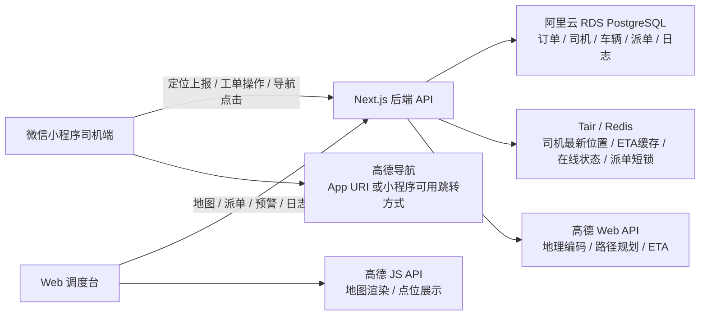

# 人车单系统生产化升级方案

版本：2026-07-04  
适用范围：人车单调度系统 demo 原型升级为生产级 Web 调度台 + 司机手机端应用  
基准约束：保持 `CLAUDE.md` / `AGENTS.md` 中的阶段边界、技术栈、API 响应、日志和状态机规则不变。  
设计基准：保留 `docs/demo-v12-ui-ux-spec.md` 与 `docs/demo-v12-api-contract.md` 作为正式前端视觉、交互和接口 DTO 约束。

## 1. 目标

将现有 demo_v12 原型和 Next.js 演示系统升级为可真实运行的生产级调度软件，覆盖以下能力：

- Web 调度台可查看订单、司机、车辆、门店、预警和日志。
- 手机端司机应用可真实上报人员位置、查看工单、认领/接单/完单、一键导航。
- 阿里云数据库真实保存订单、司机、车辆、派单、日志和位置相关数据。
- 高德 API 真实提供地理编码、路径规划、ETA 和导航跳转能力。
- 多账号可同时登录和并发使用，派单动作具备事务保护和短锁。
- UI/UX 与 demo_v12 已定型设计规则保持一致，功能升级不破坏现有布局约束。

## 2. 总体架构

架构原则：

- RDS PostgreSQL 是事实数据库，保存业务最终状态和审计数据。
- Tair / Redis 是热数据层，保存实时位置、在线状态、ETA 缓存和派单短锁。
- 高德只承担地图与地理能力，不托管工单、派单和调度规则。
- Next.js 后端继续承担状态机、事务、API 契约和 DTO Adapter。
- Web 调度台消费系统聚合后的数据，不在 hover 或普通点击时无限直连高德 API。
- 微信小程序负责司机移动端工作流，位置数据由小程序上报到本系统。

## 3. 平台分工

| 平台 | 生产职责 | 不承担 |
|---|---|---|
| 阿里云 RDS PostgreSQL | 订单、司机、车辆、门店、派单、日志、地理编码结果、位置采样历史 | 高频实时位置读写 |
| Tair / Redis | 司机最新位置、在线状态、ETA 短缓存、派单短锁、热点筛选结果 | 业务事实记录 |
| 高德 API | 地理编码、逆地理编码、路径规划、ETA、导航跳转 | 猎鹰轨迹、智能调度、工单管理 |
| Next.js 后端 | 状态机、事务、鉴权、接口契约、日志、派单规则、Adapter | 第三方原始数据直透前端 |
| 微信小程序 | 司机定位、工单、认领、接单、完单、一键导航 | 调度员工作台和派单算法 |
| Web 调度台 | 地图看板、订单池、派单、改派、预警、日志查询 | 司机后台定位采集 |

## 4. 核心业务链路

### 4.1 订单接入

1. 外部订单 API 进入 `POST /api/orders/ingest`。
2. 后端 Adapter 将外部字段映射为项目内 `OrderDTO`。
3. 首次入库或地址变更时调用高德地理编码。
4. 经纬度、解析状态、置信度、失败原因写入 RDS。
5. 地址解析失败进入预警中心，不阻断其他订单入库。

要求：

- 订单字段变化先修改 Adapter，不直接改前端组件。
- 地理编码结果入库后复用，避免重复调用高德。
- 已完成订单不进入订单池主待处理卡片。

### 4.2 司机位置同步

1. 微信小程序定时或事件触发调用 `POST /api/driver/location`。
2. 后端校验司机身份、坐标合法性、设备状态和任务状态。
3. 最新位置写入 Tair：`driver:last_location:{driverId}`。
4. 关键节点或固定间隔采样写入 RDS：`driver_locations`。
5. Web 调度台通过 SSE、WebSocket 或短轮询获取最新位置。

建议频率：

- 执行中司机：5-15 秒上报一次，具体以微信能力和电量表现实测确定。
- 非执行中司机：30-60 秒心跳或仅状态变更上报。
- 离线判定：超过 90-180 秒无心跳，标记为离线或位置过期。

不确定项：

- 微信小程序后台持续定位能力、审核要求和服务类目限制需要通过微信官方文档和真机审核进一步确认。
- 如后台定位不可稳定使用，V1.5 先采用“司机打开小程序执行任务时定位”的方案。

### 4.3 地图看板

地图看板继续遵循 demo_v12 设计：

- 左侧深色导航栏、工作面板、右侧主工作区三栏结构不变。
- 地图只在地图看板 step 中展示，其他 step 不展示地图。
- 订单、司机、预警、车辆为地图内对象切换，不跳转其他 step。
- 点位选择后当前对象放大，其余对象降低透明度。
- 地图底部详情卡和推荐派单 Top N 保持固定高度与内部滚动。

真实数据来源：

| 点位 | 数据源 |
|---|---|
| 订单点位 | RDS 中订单取还车坐标 |
| 司机点位 | Tair 最新位置，过期后回退 RDS 最近采样 |
| 车辆点位 | 车辆 GPS 或当前绑定司机位置 |
| 门店点位 | RDS 门店基础坐标 |
| 预警点位 | 订单、司机、车辆关联对象坐标 |

### 4.4 ETA 与路径规划

生产中不能每次卡片 hover 或普通点击都实时调用高德。推荐策略：

1. 先用本地数据预筛候选司机：
   - 司机状态是否可调度。
   - 是否在线。
   - 是否锁单。
   - 是否同门店或邻近门店。
   - 直线距离是否在合理范围。
   - 当前负载和后续工单是否冲突。
2. 只对 Top K 候选调用高德路径规划。
3. 将结果写入 Tair，按 `eta:{orderId}:{driverId}:{mode}` 缓存。
4. TTL 建议 30-120 秒，调度确认前可强制刷新一次。
5. 高德失败时使用降级值，标记“需人工判断”，不抛异常阻断页面。

展示要求：

- Web 地图上展示主方案和备用方案。
- 至少展示：预计到达时间、距离、出行方式、路径摘要。
- 驾车优先用于派单引擎；公交/地铁可用于辅助展示，不作为司机驾车派单主依据。

### 4.5 一键派单

派单链路：

1. 调度员选择订单。
2. 后端推荐 Top N 司机。
3. 调度员选择司机卡片，卡片保持高亮待确认。
4. 点击派单。
5. 后端加 Tair 短锁：`dispatch:lock:{orderId}`。
6. Prisma 事务写入 assignment、更新 order、写 operation log。
7. 返回统一 API 响应和 traceId。
8. Web 当前地图页自动刷新订单详情、推荐结果和日志，不跳转订单池。
9. 司机端收到新工单，进入待接单或待认领状态。

并发要求：

- 同一订单同一时间只能存在一个有效派单确认。
- 重复点击、双调度员并发派单必须返回明确冲突信息。
- 冲突场景响应需携带 traceId，并提示刷新或重新推荐。

## 5. 多账号注册登录与并发使用

生产账号类型：

| 角色 | 使用端 | 权限 |
|---|---|---|
| `admin` | Web 调度台 | 用户管理、系统配置、全部数据 |
| `dispatcher` | Web 调度台 | 地图看板、派单、改派、撤回、日志查询 |
| `driver` | 微信小程序 | 位置上报、工单、接单、完单、导航 |
| `system` | 后端任务 | 外部订单同步、地理编码、批处理 |

登录与会话：

- Web 端保留 NextAuth / session 方案。
- 小程序端建议采用手机号或企业内部账号绑定，再换取后端 session token。
- 密码必须哈希保存，不允许明文。
- 所有写操作都记录 operator、role、traceId。

并发控制：

- 派单、改派、撤回使用数据库事务。
- 派单确认增加 Tair 短锁，防止同一订单被重复派。
- 前端收到 409 冲突时，提示“订单已发生变化，请刷新后重试”，并自动刷新当前对象。
- 日志查询、地图刷新、订单筛选为读操作，可并发访问。

容量目标建议：

- 调度员：几十到数百并发。
- 司机端：千人量级在线。
- 位置上报：按在线司机分层频率控制，避免全部司机高频写 RDS。
- 地图看板：默认只展示当前区域/筛选范围，不一次性渲染全量对象。

## 6. 交互响应速度

目标体验：

| 操作 | 目标响应 |
|---|---|
| 登录 / 切换页面 | 1 秒内完成首屏反馈 |
| 订单筛选 / 日志筛选 | 本地输入即时反馈，服务端查询 300-800ms 内返回 |
| 地图点位切换 | 不跳页，200ms 内有高亮反馈 |
| 推荐派单 | 先返回本地预筛结果，再补齐真实 ETA；常规场景 1-3 秒 |
| 确认派单 | 事务提交 1 秒内返回，完成后自动刷新 |
| 司机位置刷新 | 地图端 5-15 秒级更新，异常时显示位置过期 |

实现策略：

- 前端保留 demo_v12 固定画布、固定模块高度和内部滚动轨道。
- 搜索输入做 debounce，避免每个字符都请求后端。
- ETA 使用短 TTL 缓存，不重复打高德。
- 地图 Marker 差量更新，避免全量销毁重建。
- 列表分页默认 20 条，可选 50 / 100 条。
- 大字段使用横向轨道和省略，不压缩破坏布局。

## 7. 数据缓存与稳定性

### 7.1 Tair Key 设计建议

| Key | 内容 | TTL |
|---|---|---|
| `driver:last_location:{driverId}` | 最新经纬度、精度、速度、上报时间 | 2-5 分钟 |
| `driver:online:{driverId}` | 在线状态、最后心跳 | 2-5 分钟 |
| `eta:{orderId}:{driverId}:driving` | 驾车 ETA 和距离 | 30-120 秒 |
| `dispatch:lock:{orderId}` | 派单短锁 | 5-15 秒 |
| `map:snapshot:{storeId}` | 当前门店地图快照 | 5-30 秒 |

### 7.2 降级策略

| 故障 | 降级 |
|---|---|
| 高德地理编码失败 | 订单入库但标记需复核，预警中心展示 |
| 高德路径规划失败 | ETA = 9999 或展示“需人工判断”，不阻断人工派单 |
| Tair 不可用 | 退回 RDS 最近位置采样，实时性下降但系统可用 |
| RDS 连接异常 | 写操作失败并返回 traceId，前端保留当前状态 |
| 小程序定位失败 | 司机端提示重新授权，Web 显示位置过期 |

### 7.3 观测指标

生产必须统计：

- 订单导入成功率、地理编码成功率。
- 高德 API 成功率、平均耗时、失败原因。
- ETA 缓存命中率。
- 派单推荐耗时。
- 派单确认冲突率。
- 司机在线率、位置上报延迟。
- Web 地图刷新耗时。
- 小程序工单操作成功率。

## 8. 保留现有设计规则与约束

正式前端继续以 `docs/demo-v12-ui-ux-spec.md` 为准：

- 保留灰蓝底、暖锈色主操作、低饱和状态色，不回退蓝白 SaaS。
- 保留 `--design-w`、`--design-h`、`--app-scale` 的整体缩放逻辑。
- 保留左侧导航、左侧工作面板、右侧主工作区三栏布局。
- `body` 不使用页面级滚动，超出内容走模块内部轨道。
- 地图看板的详情卡和推荐派单 Top N 固定高度，不随内容撑开。
- 订单、司机、车辆、日志等表格使用横向轨道承载宽字段。
- 功能新增优先在现有容器内嵌入，不新增破坏比例的浮层。

设计更新流程：

1. 先更新 UI/UX 规格文档。
2. 再做镜像 HTML 或原型验证。
3. 用户确认后再进入正式 Next.js 页面。
4. 正式代码不得绕过 demo_v12 的尺寸、色彩和交互约束。

## 9. 阶段边界与开发顺序

本升级不得把所有能力一次性塞进当前 worktree。建议新建生产化升级批次，仍按既有阶段边界执行：

| 顺序 | 阶段 | 主要任务 | 禁止 |
|---|---|---|---|
| 1 | docs-prd | 冻结生产化 PRD、字段映射、位置策略、高德策略 | 写代码 |
| 2 | data-model | RDS PostgreSQL schema、位置表、地理编码表、迁移脚本 | 页面和业务 API |
| 3 | integration-adapter | 订单 Adapter、高德 Adapter、Tair Adapter | 页面和派单规则 |
| 4 | driver-workflow | 小程序司机 API 契约、位置上报、工单操作 | Web 页面重构 |
| 5 | map-board | 真实地图点位、实时位置、ETA 展示 | 派单事务修改 |
| 6 | dispatch-rule-v1 | 预筛、ETA 缓存、短锁、推荐排序 | schema 修改 |
| 7 | admin-workflow | 调度员操作体验、冲突刷新、日志入口 | 地图底层重写 |
| 8 | logging-observe | traceId、埋点、指标、错误降级 | 业务规则变更 |
| 9 | stabilization | 压测、演示脚本、回归和 runbook | 新功能 |

任何 schema 变更必须在 data-model 阶段完成，并先生成迁移 SQL 供审查。

## 10. 生产验收标准

### 10.1 功能验收

- 多账号可注册、登录、退出。
- 两个调度员同时操作同一订单时，不会重复派单。
- 司机端可上报位置，Web 地图可看到位置变化。
- 订单地址可地理编码并在地图展示。
- 推荐派单能基于真实 ETA 展示 Top N。
- 派单、改派、撤回、接单、完单均有日志。
- 点击导航可跳转到高德可用导航方案。

### 10.2 性能验收

- 1000 名司机模拟在线时，系统不因位置上报压垮 RDS。
- 地图看板切换对象不卡死。
- 推荐派单在常规候选数量下 1-3 秒内返回。
- ETA 缓存命中后响应明显快于实时高德调用。
- 高德 API 失败不会导致页面白屏或派单链路崩溃。

### 10.3 稳定性验收

- `pnpm lint` 通过。
- `pnpm build` 通过。
- 核心 API 返回统一 `{ success, data, error, traceId }`。
- 写操作有 Pino 结构化日志。
- 关键错误可通过 traceId 定位。
- 演示脚本可连续执行至少 3 轮。

## 11. 成本与付费判断

在不接入高德猎鹰、不接入高德智能调度的前提下，仍可能产生费用的部分：

- 高德地理编码。
- 高德路径规划 / ETA。
- 高德 JS 地图或定位相关调用。
- 阿里云 RDS PostgreSQL 实例。
- Tair / Redis 实例。
- 服务器、带宽、日志和监控服务。

控制成本的方法：

- 地理编码只在订单入库或地址变更时调用。
- ETA 只对预筛后的少量候选司机调用。
- ETA 结果短 TTL 缓存。
- 司机最新位置写 Tair，历史位置采样写 RDS。
- 地图按门店、时间和状态筛选，不展示全量数据。

待求证项：

- 高德当前账号的免费额度、QPS、商业授权要求。
- 微信小程序后台定位审核和服务类目要求。
- 阿里云 RDS PostgreSQL 与 PolarDB PostgreSQL 的最终规格和预算。
- Tair 实例规格是否满足千人位置上报与 ETA 缓存。

## 12. 推荐落地路线

第一阶段：生产化文档冻结

- 冻结字段映射、订单生命周期、司机状态、位置上报协议。
- 明确 Supabase 到阿里云 RDS PostgreSQL 的迁移边界。
- 明确高德调用策略和缓存策略。

第二阶段：云数据库与缓存底座

- 创建阿里云 RDS PostgreSQL。
- 创建 Tair / Redis。
- 配置网络、白名单、最小权限账号。
- 建立迁移和回滚方案。

第三阶段：司机位置最小闭环

- 小程序端完成登录、位置授权、位置上报。
- 后端写 Tair 最新位置和 RDS 采样。
- Web 地图展示真实司机点位。

第四阶段：真实 ETA 与派单闭环

- 高德路径规划接入派单推荐。
- Top N 司机推荐使用真实 ETA。
- 派单确认加短锁和事务。
- Web 自动刷新地图和日志。

第五阶段：生产压测与演示收口

- 模拟千人在线和高频位置上报。
- 验证高德限流、缓存命中和失败降级。
- 完成正式 runbook、故障处理和回归脚本。

## 13. 参考依据

- 项目本地规范：`CLAUDE.md`
- 项目本地规范：`AGENTS.md`
- UI/UX 规格：`docs/demo-v12-ui-ux-spec.md`
- API 契约：`docs/demo-v12-api-contract.md`
- 高德前置检查：`feature-admin-workflow/docs/amap-preflight-report.md`
- 演示 Runbook：`feature-admin-workflow/docs/runbook.md`
- 高德地理编码文档：https://lbs.amap.com/api/webservice/guide/api/georegeo
- 高德路径规划文档：https://lbs.amap.com/api/webservice/guide/api/direction
- 高德流量限制说明：https://lbs.amap.com/api/webservice/guide/tools/flowlevel
- 高德服务升级与价格页：https://lbs.amap.com/upgrade
- 阿里云 RDS PostgreSQL：https://help.aliyun.com/zh/rds/apsaradb-rds-for-postgresql/
- 阿里云 Tair / Redis：https://help.aliyun.com/zh/redis/
