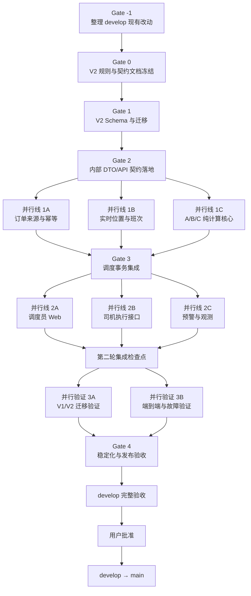

# PRD V2 并行开发与分阶段验收设计

> 文档版本：`RCD-V2-PARALLEL-DESIGN-20260713`
> 状态：总体架构已批准；Gate -1 已通过验收，Gate 0 已通过（候选验收 SHA `0a83243`）
> 产品主线：`docs/versions/v2.0/prd-v2.md`
> 数据主线：`docs/versions/v2.0/data-architecture-v2.md`
> 规则主线：`docs/versions/v2.0/project-rules-v2.md`

## 1. 目的

本设计用于组织人车单系统从 V1 向 PRD V2 的兼容演进。开发由用户在新的命令行界面中调用外部编码工具完成；本项目 Codex 负责阶段边界、代码一致性、数据安全和业务验收。

执行原则：

- V1 继续可运行，不另起炉灶重写。
- 先冻结文档、Schema 和公共契约，再启动并行开发。
- 一个 worktree 对应一个目标和一组独占文件。
- 每轮开发结束后停止推进，由 Codex 验收。
- 只有上一轮验收通过，才能创建下一轮分支和 worktree。
- 任何工具都不得绕过 `feature/* → develop → main`。

## 2. 已确认的基础假设

- 正式应用代码当前位于 `feature-admin-workflow/`，本计划不迁移或重命名该目录。
- PRD V2、数据架构 V2 和项目规则 V2 高于 V1 业务规则。
- `AGENTS.md` 中不冲突的技术栈、分支、worktree、API、日志、命名和测试纪律继续有效。
- V1 状态、类型和接口在兼容窗口内保留，删除前必须完成迁移验收并获得用户批准。
- 车辆继续展示，但不得进入 V2 候选过滤、评分或迟到判断。
- 外部订单字段只存在于 Adapter 和来源事件层。
- PostgreSQL/RDS 保存业务事实；Redis/Tair 保存实时或短期数据。
- 并行实现最多三条开发线，另保留一条主控线负责协调和验收。

## 3. 总体并行架构



Gate 2 本身不是并行阶段。只有 Gate 2 已合入 `develop` 且验证通过，第一轮三个并行 Agent 才能启动。

## 4. 串行闸门

### 4.1 Gate -1：基线整理

目标：将当前 `develop` 恢复为可运行、可追溯、可作为 V2 分支基线的状态。

工作内容：

- 盘点 `develop` 中所有已修改、已删除和未跟踪文件。
- 为每项改动确认来源、阶段归属和保留方式。
- 不覆盖、不删除、不擅自暂存用户已有改动。
- 将有效改动提交到正确分支，再按规则合入 `develop`。
- 处理嵌套 worktree 或子目录的脏状态。
- 验证 V1 当前基线仍可运行。

退出条件：

- `develop` 工作区干净。
- 当前基线的测试、检查和生产构建通过。
- V2 文档分支符合 `feature/*` 命名。
- 当前基线提交 SHA 已记录。

### 4.2 Gate 0：V2 规则与契约文档冻结

建议分支：`feature/v2-baseline`

允许范围：

- `AGENTS.md`
- `docs/versions/README.md`（文档注册表与权威顺序入口）
- `docs/versions/v1/README.md`（V1 历史索引的链接修复）
- `docs/versions/v2.0/**`
- `docs/superpowers/specs/**`

交付内容：

- PRD V2、数据架构 V2 和项目规则 V2 的版本入口。
- V2 领域词汇、订单生命周期和调度规则。
- `CanonicalOrder V2` 文档契约。
- V2 API 契约。
- V1 → V2 状态和数据兼容映射。
- V2 worktree 白名单和共享文件所有权。
- 位置有效性、可行性、ETA 缓存、采样和重排触发口径。

退出条件：

- 不存在未解决的占位符、相互矛盾或双重解释。
- `AGENTS.md` 明确区分继续有效的工程铁律和已被 V2 覆盖的业务规则。
- 本阶段不修改 `.ts`、`.tsx` 或 `.prisma`。
- 文档审查通过并合入 `develop`。

### 4.3 Gate 1：V2 Schema 与迁移

建议分支：`feature/v2-data-model`

独占范围：

- `feature-admin-workflow/prisma/schema.prisma`
- `feature-admin-workflow/prisma/migrations/**`
- `feature-admin-workflow/prisma/seed.js`

交付内容：

- 扩展 `Order`、`Driver`、`Assignment` 和 `OperationLog`。
- 新增 `OrderSourceEvent`、`DriverShift`、`OrderServicePlan`、`DispatchAlert` 和 `DriverLocationSample`。
- 增加计划顺序、`planVersion`、计划时间、锁定和执行时间字段。
- V1 数据兼容策略、迁移 SQL 和 rollback SQL。
- 与 V2 场景匹配的种子数据。

退出条件：

- Prisma Schema 校验通过。
- 迁移 SQL 已人工审查。
- 正向迁移和回滚演练通过。
- V1 数据无丢失，关键表数量和关键字段核对通过。
- 未修改页面、API Route 或调度业务逻辑。

### 4.4 Gate 2：内部 DTO/API 契约落地

建议分支：`feature/v2-contracts`

独占范围：

- `feature-admin-workflow/src/types/v2/**`
- `feature-admin-workflow/src/lib/contracts/v2/**`
- 经批准的统一响应契约小改

交付内容：

- `CanonicalOrderV2`。
- 执行状态、可行性、锁定和计划顺序类型。
- 调度输入、输出和事件类型。
- 位置、ETA、预警和服务模块 DTO。
- 并发冲突、非法流转和外部依赖故障错误契约。
- 契约测试与固定测试夹具。

退出条件：

- 无 `any` 和重复业务类型。
- 外部字段未扩散到调度 DTO。
- 车辆字段未进入调度输入。
- API 返回 `{ success, data, error, traceId }`。
- 并发冲突返回 409 和当前 `planVersion`。
- 非法流转返回 400，并包含 `currentStatus` 和 `targetStatus`。
- Gate 2 合入 `develop` 后全量验证通过。

## 5. 第一轮并行开发

三个分支必须从 Gate 2 合入后的同一个 `develop` SHA 创建。

### 5.1 并行线 1A：订单来源与幂等

建议分支：`feature/v2-order-source`

独占范围：

- `feature-admin-workflow/src/lib/adapters/order-source/**`
- 经契约冻结的订单接入 API
- `OrderSourceEvent` 入库实现

验收标准：

- 完整实现 `validate → normalize → map → CanonicalOrder`。
- 使用 `(sourceSystem, externalOrderId, sourceVersion)` 幂等。
- 相同版本返回已有处理结果。
- 新版本更新订单快照并保存来源事件和前后值。
- 单条失败不阻断整批，逐条错误包含 traceId。
- 外部原始状态不直接写入内部执行状态。
- 外部 API 故障不影响已进入内部系统的订单。

### 5.2 并行线 1B：实时位置与班次

建议分支：`feature/v2-realtime-location`

独占范围：

- `feature-admin-workflow/src/lib/location/**`
- `feature-admin-workflow/src/lib/shifts/**`
- 经契约冻结的位置和班次 API

验收标准：

- 只有已上班、位置有效且可用的司机参与调度。
- 位置包含采集时间和精度。
- 过期位置明确标注并排除调度。
- Redis/Tair 保存最新位置和在线状态，数据库保存班次与采样历史。
- 执行中司机不能下班。
- 下班释放所有尚未出发任务。
- Redis/Tair 故障时不伪造实时位置。

### 5.3 并行线 1C：A/B/C 纯计算核心

建议分支：`feature/v2-dispatch-core`

独占范围：

- `feature-admin-workflow/src/lib/dispatch-v2/core/**`
- 纯算法测试与夹具

验收标准：

- 每名司机只规划 A/B/C。
- 优先处理承诺取车时间更早的订单。
- 排除预计迟到超过 30 分钟的组合。
- 可行组合优先衔接 ETA 最短的司机和位置。
- 尊重 `AUTO_FROZEN` 和 `MANUAL_LOCKED`。
- 车辆不参与过滤、评分或迟到判断。
- 核心算法不直接访问 Prisma、Redis、HTTP 或 API Route。
- 固定输入产生确定性输出，边界场景有单元测试。

## 6. 调度集成闸门

### 6.1 Gate 3：调度事务集成

建议分支：`feature/v2-dispatch-integration`

前置条件：第一轮三条并行线依次合入 `develop`，每次合并后均通过全量验证。

独占范围：

- `feature-admin-workflow/src/lib/dispatch-v2/application/**`
- `feature-admin-workflow/src/lib/dispatch-v2/repositories/**`
- 经契约冻结的调度 API 和事件触发器

交付内容：

- Redis/Tair 调度短锁。
- `planVersion` 乐观锁。
- Assignment 数据库事务提交。
- 高德 ETA 预筛、缓存和不可用处理。
- 新订单、订单变化、位置变化、班次变化、执行事件和模块变化触发局部重排。
- `DispatchAlert` 创建、更新和解决。
- 自动重排与人工修改版本日志。

退出条件：

- 旧计算不能覆盖新计划。
- 重复事件不会产生重复排程或重复派单。
- 到达后服务端拒绝改派。
- 高德失败返回 ETA 不可用，不使用假 ETA 或演示数字。
- 锁、版本验证、Assignment、预警和日志在一致的事务边界内提交。
- 并发和状态流转测试通过。

Gate 3 只能由单一实现线完成，禁止多个 Agent 同时修改调度提交事务。

## 7. 第二轮并行开发

三个分支必须从 Gate 3 合入后的同一个 `develop` SHA 创建。

### 7.1 并行线 2A：调度员 Web

建议分支：`feature/v2-admin-console`

独占范围：

- 调度员地图、订单池、司机时间轴和前端组件
- `feature-admin-workflow/src/app/globals.css`
- V2 设计变量和全局导航

验收标准：

- 同屏展示地图和选中司机 A/B/C 时间轴。
- 地图、列表和时间轴联动。
- 时间轴区分空驶 ETA、固定模块、工单驾驶、空闲和迟到风险。
- 不可行预警至少在地图、列表和时间轴中的两处可见。
- 显示位置更新时间和过期状态。
- 支持手动派单、改派、解除锁定和修改订单时间或地点。
- 保留深色导航、灰蓝背景、暖锈强调色和克制的信息密度。
- 导航 rail 72px、工作面板 420px、控件 38px、点击目标至少 44px。
- 页面级不滚动，密集模块内部滚动。
- 状态同时使用颜色、图标和中文标签。

### 7.2 并行线 2B：司机执行接口

建议分支：`feature/v2-driver-workflow`

独占范围：

- 经契约冻结的司机班次、模块、出发、到达和完成 API

验收标准：

- 司机只能操作自己的任务。
- 司机不能拒单或改派。
- 出发后 A 自动冻结并触发导航相关流程。
- 到达开始实际计时。
- 到达后任何角色都不能改派。
- 完成停止实际计时并触发后续重排。
- 服务模块变化立即重算后续时间轴并记录日志。
- 执行中司机不能下班。

### 7.3 并行线 2C：预警与观测

建议分支：`feature/v2-observability`

独占范围：

- `feature-admin-workflow/src/lib/logger.ts`
- trace 中间件
- 预警和日志 API
- 后端观测逻辑

验收标准：

- 导入、自动排程、人工改派、订单修改和模块修改全部带 traceId。
- 自动和人工变更保存原值、新值、操作者、时间、原因和 traceId。
- `INFEASIBLE` 是持久业务对象，不是普通日志。
- 预警解决后保留历史记录。
- 禁止 `console.log`。
- API 响应头包含 `X-Trace-Id`。

所有前端导航和视觉样式由 `v2-admin-console` 统一管理，`v2-observability` 不修改共享布局。

## 8. 并行验证与最终稳定化

### 8.1 第二轮集成检查点

第二轮三条分支依次合入 `develop`。每次合并后执行全量测试、静态检查和生产构建。三条线全部通过后，才允许启动验证分支。

### 8.2 并行验证 3A：V1/V2 迁移验证

建议分支：`feature/v2-migration-validation`

验收标准：

- V1 状态正确映射到 V2 正交维度。
- V1 页面和接口在兼容窗口内仍可运行。
- 影子写入或双读核对通过。
- 关键表数量、字段、坐标、时间和取消状态一致。
- 更换 Adapter 不修改调度核心、Redis Key、高德和前端 DTO。
- 回滚脚本实际演练通过。

该分支只做验证脚本、报告和兼容检查。发现 Schema 问题时重新进入受控的数据模型修复分支，不直接修改已冻结 Schema。

### 8.3 并行验证 3B：端到端与故障验证

建议分支：`feature/v2-e2e-validation`

验收标准：

- PRD V2 十项验收全部有自动测试或明确验证记录。
- 并发重排、重复订单、重复派单和版本冲突测试通过。
- 高德、Redis/Tair 和外部订单源故障测试通过。
- 无假 ETA、假位置或最后写入者无条件覆盖。
- Chrome 和 Edge 在 100% 与 125% 缩放下布局稳定。
- `pnpm test`、`pnpm lint` 和 `pnpm build` 通过。

### 8.4 Gate 4：稳定化与发布验收

建议分支：`feature/v2-stabilization`

只允许：

- 影响演示、迁移或发布的缺陷修复。
- 测试修复。
- 运行手册、发布说明和回滚说明。

禁止：

- 新功能。
- 新数据表。
- 大规模重构。
- 未经批准删除 V1 兼容层。

退出条件：

- 六步以上的正式演示脚本完整走通。
- 数据迁移、回滚、并发和故障场景验证通过。
- `develop` 可运行、可演示、可回滚。
- 用户批准后才允许 `develop → main`。

## 9. 并行开发纪律

- 同时最多三条实现线，另保留一条主控线。
- 每轮 worktree 只能在前置 Gate 合入并验证通过后创建。
- 不提前创建后续阶段分支。
- 并行分支不得互相合并或 cherry-pick。
- 每个分支只能修改自己的独占范围。
- Schema 只有 `v2-data-model` 能修改。
- 公共 DTO 和契约只有 `v2-contracts` 能修改。
- 全局样式和设计变量只有 `v2-admin-console` 能修改。
- logger 基础设施只有 `v2-observability` 能修改。
- 调度提交事务只有 `v2-dispatch-integration` 能修改。
- 契约需要变化时，受影响并行线全部暂停，由主控线统一修改并重新建立共同基线。
- 每条 feature 依次合入 `develop`，每次合入后重新执行完整验证。
- 不以“页面能打开”替代业务闭环验收。
- 不允许任何开发工具直接提交、合并或推送到 `main`。

## 10. 外部命令行开发协作协议

### 10.1 角色

用户和外部编码工具负责：

- 在指定分支和 worktree 内实现当前阶段。
- 遵守本设计和 V2 文档。
- 执行阶段测试并保存结果。
- 提供完整交付说明。

本项目 Codex 负责：

- 检查分支、worktree 和文件边界。
- 审查 Schema、事务、并发、状态机、API、日志、类型和 UI 约束。
- 独立复跑必要测试。
- 给出 `PASS`、`WARN` 或 `FAIL` 结论。
- 只有 `PASS` 才放行下一轮。

外部工具的“已完成”声明不等于验收通过。

### 10.2 每轮启动提示词模板

```text
你正在实施人车单系统 PRD V2 的一个受控阶段。

当前阶段：<Gate 或并行线名称>
当前分支：<feature/v2-*>
当前 worktree：<绝对路径>
基线 develop SHA：<SHA>

必须读取：
1. docs/versions/v2.0/prd-v2.md
2. docs/versions/v2.0/data-architecture-v2.md
3. docs/versions/v2.0/project-rules-v2.md
4. docs/superpowers/specs/2026-07-13-prd-v2-parallel-development-design.md
5. 当前阶段关联的 V2 契约文档

只允许修改：<本阶段独占文件范围>
禁止修改：Schema、公共 DTO、共享样式、logger、其他并行线目录，除非它们属于当前阶段独占范围。

开始前先输出：假设、文件范围、测试计划和退出条件。
先写失败测试或复现用例，再实现最小改动。
不得提前实现下一阶段功能。
不得直接合并 develop 或 main。

完成后按“阶段交付模板”报告，不要只说已完成。
```

### 10.3 阶段交付模板

```text
【阶段交付】
- 阶段：
- 分支：
- worktree：
- 基线 develop SHA：
- 当前 HEAD SHA：
- 做了什么：
- 没做什么：
- 修改文件：
- 数据库迁移及回滚：不涉及 / 文件与验证结果
- 测试命令与结果：
- 构建结果：
- 手工业务验收：
- 已知风险：
- 回滚方式：
- 是否满足退出条件：
```

阶段交付必须包含真实命令结果、提交 SHA 和文件清单。只提供截图、口头说明或“测试通过”结论不足以进入验收。

## 11. Codex 验收流程

收到阶段交付后，按以下顺序验收：

1. 核对分支、worktree、基线和提交 SHA。
2. 检查 diff 是否越过文件白名单。
3. 加载 PRD V2、数据架构、项目规则和阶段契约。
4. 执行 P0、P1、P2 审查。
5. 独立运行与风险相称的测试、构建或迁移验证。
6. 对照阶段退出条件逐条验收。
7. 输出结论。

结论定义：

- `PASS`：无 P0/P1 未解决项，退出条件全部满足，允许进入下一阶段。
- `WARN`：无 P0，但存在需在当前阶段关闭的 P1；不放行下一阶段。
- `FAIL`：存在 P0、范围越权、数据风险或核心验收失败；退回当前阶段修复。

验收不通过时，仍在原分支修复。不得用新阶段分支掩盖上一阶段问题。

## 12. 发布路径

```text
各 feature/v2-* 分支
→ 逐个审查并合入 develop
→ Gate 4 完整验收
→ 用户批准发布
→ develop 合入 main
→ main 演示验证
```

任何 Agent、CLI 或外部编码工具都无权跳过用户批准直接进入 `main`。

## 13. 当前启动状态

- 已批准：总体并行架构、串行闸门、两轮并行、并行验证、稳定化和逐轮验收模式。
- Gate -1：已于 2026-07-16 通过验收。基线 `develop` SHA：`37ee8a3`（已推送 `origin/develop`）。
  - 工作区干净、测试（45/45）/lint/build（29/29 页面）全部通过。
  - V2 文档分支 `feature/v2-baseline` 命名合规，已绑定远程跟踪（`origin/feature/v2-baseline`）。
  - Gate -1 产生的 9 个提交身份已统一，develop 已推送。
- 当前工作阶段：Gate 0 已通过，候选验收 SHA `0a83243`。
- 当前执行限制：Gate 1 只能修改其独占白名单范围（Prisma Schema、迁移、种子数据）。
- 下一动作：`feature/v2-baseline` 合入 `develop` 并推送后，从 develop 基点创建 `feature/v2-data-model` 进入 Gate 1。
