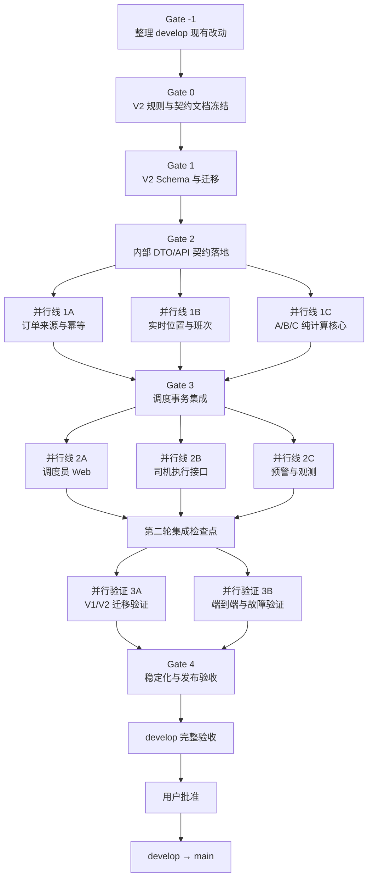

# PRD V2 并行开发与分阶段验收设计

> 文档版本：`RCD-V2-PARALLEL-DESIGN-20260713`
> 状态：总体架构已批准；Gate -1～Gate 3 已完成。Gate 3 唯一验收候选为 `codex/v2-gate3-app-candidate @ 958afca537b412fb972b6e180561a9b37022834d`，ACR index digest 为 `sha256:13e0f3c4c10599867bc8a956f9332890826edcebdbc00cef9ec826fca2415bff`。代码、镜像、运行资源、真实 10 单、worker 故障恢复、应用回退、migration 指纹和文档追溯全部通过，主控于 2026-08-11 最终裁决 Gate 3 `PASS`，PASS 文档内容基线 `464ee5d…` 已远程核验；交接分支 `b853a7a…` 已合入并推送，Gate 3 代码交接点为 `develop @ 51ddb5f…`。第二轮为 `AUTHORIZED / NOT_STARTED`，尚未创建分支
> 产品主线：`docs/versions/v2.0/prd-v2.md`
> 数据主线：`docs/versions/v2.0/data-architecture-v2.md`
> 规则主线：`docs/versions/v2.0/project-rules-v2.md`

## 1. 目的

本设计用于组织人车单系统从 V1 向 PRD V2 的兼容演进。开发由用户在新的命令行界面中调用外部编码工具完成；本项目 Codex 负责阶段边界、代码一致性、数据安全和业务验收。

执行原则：

- V1 继续可运行，不另起炉灶重写。
- 先冻结文档、Schema 和公共契约，再启动并行开发。
- 一个 worktree 对应一个目标和一组独占文件。
- 每轮开发结束后停止推进，由 Codex 验收。
- 只有上一轮验收通过，才能创建下一轮分支和 worktree。
- 任何工具都不得绕过 `feature/* → develop → main`。

## 2. 已确认的基础假设

- 正式应用代码当前位于 `feature-admin-workflow/`，本计划不迁移或重命名该目录。
- PRD V2、数据架构 V2 和项目规则 V2 高于 V1 业务规则。
- `AGENTS.md` 中不冲突的技术栈、分支、worktree、API、日志、命名和测试纪律继续有效。
- V1 状态、类型和接口在兼容窗口内保留，删除前必须完成迁移验收并获得用户批准。
- 车辆继续展示，但不得进入 V2 候选过滤、评分或迟到判断。
- 外部订单字段只存在于 Adapter 和来源事件层。
- PostgreSQL/RDS 保存业务事实；Redis/Tair 保存实时或短期数据。
- 并行实现最多三条开发线，另保留一条主控线负责协调和验收。

## 3. 总体并行架构


```mermaid
flowchart TD
    A["Gate -1<br/>整理 develop 现有改动"] --> B["Gate 0<br/>V2 规则与契约文档冻结"]
    B --> C["Gate 1<br/>V2 Schema 与迁移"]
    C --> D["Gate 2<br/>内部 DTO/API 契约落地"]

    D --> E1["并行线 1A<br/>订单来源与幂等"]
    D --> E2["并行线 1B<br/>实时位置与班次"]
    D --> E3["并行线 1C<br/>A/B/C 纯计算核心"]

    E1 --> F["Gate 3<br/>调度事务集成"]
    E2 --> F
    E3 --> F

    F --> G1["并行线 2A<br/>调度员 Web"]
    F --> G2["并行线 2B<br/>司机执行接口"]
    F --> G3["并行线 2C<br/>预警与观测"]

    G1 --> W["第二轮集成检查点"]
    G2 --> W
    G3 --> W

    W --> H1["并行验证 3A<br/>V1/V2 迁移验证"]
    W --> H2["并行验证 3B<br/>端到端与故障验证"]

    H1 --> I["Gate 4<br/>稳定化与发布验收"]
    H2 --> I
    I --> J["develop 完整验收"]
    J --> K["用户批准"]
    K --> L["develop → main"]
```

Gate 2 本身不是并行阶段。只有 Gate 2 已合入 `develop` 且验证通过，第一轮三个并行 Agent 才能启动。

## 4. 串行闸门

### 4.1 Gate -1：基线整理

目标：将当前 `develop` 恢复为可运行、可追溯、可作为 V2 分支基线的状态。

工作内容：

- 盘点 `develop` 中所有已修改、已删除和未跟踪文件。
- 为每项改动确认来源、阶段归属和保留方式。
- 不覆盖、不删除、不擅自暂存用户已有改动。
- 将有效改动提交到正确分支，再按规则合入 `develop`。
- 处理嵌套 worktree 或子目录的脏状态。
- 验证 V1 当前基线仍可运行。

退出条件：

- `develop` 工作区干净。
- 当前基线的测试、检查和生产构建通过。
- V2 文档分支符合 `feature/*` 命名。
- 当前基线提交 SHA 已记录。

### 4.2 Gate 0：V2 规则与契约文档冻结

建议分支：`feature/v2-baseline`

允许范围：

- `AGENTS.md`
- `docs/versions/README.md`（文档注册表与权威顺序入口）
- `docs/versions/v1/README.md`（V1 历史索引的链接修复）
- `docs/versions/v2.0/**`
- `docs/superpowers/specs/**`

交付内容：

- PRD V2、数据架构 V2 和项目规则 V2 的版本入口。
- V2 领域词汇、订单生命周期和调度规则。
- `CanonicalOrder V2` 文档契约。
- V2 API 契约。
- V1 → V2 状态和数据兼容映射。
- V2 worktree 白名单和共享文件所有权。
- 位置有效性、可行性、ETA 缓存、采样和重排触发口径。

退出条件：

- 不存在未解决的占位符、相互矛盾或双重解释。
- `AGENTS.md` 明确区分继续有效的工程铁律和已被 V2 覆盖的业务规则。
- 本阶段不修改 `.ts`、`.tsx` 或 `.prisma`。
- 文档审查通过并合入 `develop`。

### 4.3 Gate 1：V2 Schema 与迁移

建议分支：`feature/v2-data-model`

独占范围：

- `feature-admin-workflow/prisma/schema.prisma`
- `feature-admin-workflow/prisma/migrations/**`
- `feature-admin-workflow/prisma/seed.js`

交付内容：

- 扩展 `Order`、`Driver`、`Assignment` 和 `OperationLog`。
- 新增 `OrderSourceEvent`、`DriverShift`、`OrderServicePlan`、`DispatchAlert` 和 `DriverLocationSample`。
- 增加计划顺序、`planVersion`、计划时间、锁定和执行时间字段。
- V1 数据兼容策略、迁移 SQL 和 rollback SQL。
- 与 V2 场景匹配的种子数据。

退出条件：

- Prisma Schema 校验通过。
- 迁移 SQL 已人工审查。
- 正向迁移和回滚演练通过。
- V1 数据无丢失，关键表数量和关键字段核对通过。
- 未修改页面、API Route 或调度业务逻辑。

### 4.4 Gate 2：内部 DTO/API 契约落地

建议分支：`feature/v2-contracts`

独占范围：

- `feature-admin-workflow/src/types/v2/**`
- `feature-admin-workflow/src/lib/contracts/v2/**`
- 经批准的统一响应契约小改

交付内容：

- `CanonicalOrderV2`。
- 执行状态、可行性、锁定和计划顺序类型。
- 调度输入、输出和事件类型。
- 位置、ETA、预警和服务模块 DTO。
- 并发冲突、非法流转和外部依赖故障错误契约。
- 契约测试与固定测试夹具。

退出条件：

- 无 `any` 和重复业务类型。
- 外部字段未扩散到调度 DTO。
- 车辆字段未进入调度输入。
- API 返回 `{ success, data, error, traceId }`。
- 并发冲突返回 409 和当前 `planVersion`。
- 非法流转返回 400，并包含 `currentStatus` 和 `targetStatus`。
- Gate 2 合入 `develop` 后全量验证通过。

## 5. 第一轮并行开发

三个分支必须从 Gate 2 合入后的同一个 `develop` SHA 创建。

### 5.1 并行线 1A：订单来源与幂等

建议分支：`feature/v2-order-source`

独占范围：

- `feature-admin-workflow/src/lib/adapters/order-source/**`
- 经契约冻结的订单接入 API
- `OrderSourceEvent` 入库实现

验收标准：

- 完整实现 `validate → normalize → map → CanonicalOrder`。
- 使用 `(sourceSystem, externalOrderId, sourceVersion)` 幂等。
- 相同版本返回已有处理结果。
- 新版本更新订单快照并保存来源事件和前后值。
- 单条失败不阻断整批，逐条错误包含 traceId。
- 外部原始状态不直接写入内部执行状态。
- 外部 API 故障不影响已进入内部系统的订单。

### 5.2 并行线 1B：实时位置与班次

建议分支：`feature/v2-realtime-location`

独占范围：

- `feature-admin-workflow/src/lib/location/**`
- `feature-admin-workflow/src/lib/shifts/**`
- 经契约冻结的位置和班次 API

验收标准：

- 只有已上班、位置有效且可用的司机参与调度。
- 位置包含采集时间和精度。
- 过期位置明确标注并排除调度。
- Redis/Tair 保存最新位置和在线状态，数据库保存班次与采样历史。
- 执行中司机不能下班。
- 下班释放所有尚未出发任务。
- Redis/Tair 故障时不伪造实时位置。

### 5.3 并行线 1C：A/B/C 纯计算核心

建议分支：`feature/v2-dispatch-core`

独占范围：

- `feature-admin-workflow/src/lib/dispatch-v2/core/**`
- 纯算法测试与夹具

验收标准：

- 每名司机只规划 A/B/C。
- 优先处理承诺取车时间更早的订单。
- 排除预计迟到超过 30 分钟的组合。
- 可行组合优先衔接 ETA 最短的司机和位置。
- 尊重 `AUTO_FROZEN` 和 `MANUAL_LOCKED`。
- 车辆不参与过滤、评分或迟到判断。
- 核心算法不直接访问 Prisma、Redis、HTTP 或 API Route。
- 固定输入产生确定性输出，边界场景有单元测试。

#### 1C 第三轮复核裁决（2026-07-19）

复核结论：1C FAIL，发现 2 个 P0 + 1 个 P1 调度正确性缺口。返修规则已批准，实施记录如下。

**P0-1 订单池白名单**：订单池只接受 `UNASSIGNED` 与本轮明确释放的 `PLANNED` Assignment 对应订单。`EN_ROUTE / IN_SERVICE / COMPLETED / CANCELLED` 不得因 Assignment 快照缺失而入池。复用已实现但主流程未调用的 `filterDispatchableOrders()`。

**P0-2 COMPLETED 工单退场**：`COMPLETED` Assignment 从 `isImmobile` 保护名单移除；分类循环最前面做终态短路丢弃（`COMPLETED` / `CANCELLED`），不进入 seqMap、proposal 或 cursor 推进。`EN_ROUTE / IN_SERVICE` 继续保护。`MANUAL_LOCKED + COMPLETED` 也丢弃——锁不能复活终态。反转既有 `"COMPLETED assignment is immobile (never released)"` 测试。

**P1 多槽遍历择优**：`findBestSlot` 遍历每名司机全部开放槽位，对每个 `(driver, seqNo)` 组合独立计算 cursor、slack 与 laterImmobileBound。择优比较器 `(deadheadMinutes, driverId, seqNo)` 字典序。PRD V2 §6.2 第三条「在可行组合中优先选择衔接 ETA 最短的司机与槽位」要求比较所有可行司机-槽位组合，修复后满足。

**返修接受条件**：至少 3 个回归场景——孤立 `EN_ROUTE / IN_SERVICE` 不入池、`COMPLETED` 不占槽（含 `MANUAL_LOCKED + COMPLETED` 仍丢弃）、A 不可行但 C 可行时选择 C。通过后进入 1C 终审。

## 6. 调度集成闸门

### 6.1 Gate 3：调度事务集成

建议分支：`feature/v2-dispatch-integration`

前置条件：第一轮三条并行线依次合入 `develop`，每次合并后均通过全量验证。

独占范围：

- `feature-admin-workflow/src/lib/dispatch-v2/application/**`
- `feature-admin-workflow/src/lib/dispatch-v2/repositories/**`
- 经契约冻结的调度 API 和事件触发器
- 仅为实现“业务事实 + 调度 outbox 同事务提交”而批准的 1A/1B 业务写入点精准改动；不得借此重构 Adapter、位置或班次模块

**Gate 3-3 范围冻结（2026-07-26）**：G3-3 仅完成调度应用编排、Redis/数据库锁、事务提交，以及过期快照、幂等和并发验收；ETA 矩阵正确性是编排前置条件，必须覆盖本轮新规划订单产生的 delivery cursor。G3-3 继续使用 `feature/v2-gate3-review-remediation`，不另建分支，不进入第二轮 Web、司机执行或观测功能。

**Gate 3 最小 E2E 入口例外（2026-08-09，当前有效）**：为完成已经获批的上海
`G3E2E` 真实业务验收，允许在唯一候选
`codex/v2-gate3-app-candidate` 上串行补齐 API 契约 V2 已冻结、但候选代码尚缺的最小
入口：修正绑定司机账号登录后返回司机 H5；复用现有司机会话调用
`POST /api/v2/driver/shift/start`，不在 Gate 3 新增 H5 上下班按钮；补齐司机本人
`depart / arrive / complete` 与调度员 `reassign` 路由、同事务业务事实/outbox、
`planVersion`、Redis/数据库锁、鉴权、幂等、非法流转和并发反例。该例外不得新增页面、
Schema、migration、枚举、DTO、依赖或观测功能，不得实现契约外功能，也不得据此启动
第二轮并行。完成本地全量回归、新 SHA/镜像/ECS 更新后，方可投递冻结的 10 单并执行
手工改排验收。

**Gate 3 两台真实设备 / 门店账号串行执行覆盖（2026-08-10，当前有效）**：本轮真实业务
验证的运行基线固定为 `958afca537b412fb972b6e180561a9b37022834d`，ACR index digest 为
`sha256:13e0f3c4c10599867bc8a956f9332890826edcebdbc00cef9ec826fca2415bff`；ECS app、worker
已按该 digest 运行，Nginx 仅刷新相同 revision，原镜像、配置、证书和端口未变。五个冻结
司机账号的 H5 登录、自动上班和链路可达结论继续有效；受真实设备数量限制，本轮只使用
两台 iOS Safari 真机，手机 1 保持司机 01，手机 2 按场景依次切换司机 03、司机 05。
司机 02 的既有真机位置只作为失败现场证据，不再承担跨门店自动调度目标；不得把三个
账号的串行覆盖表述为三台或五台真机覆盖。该安排只修正验收执行拓扑和目标司机映射，
不改变产品行为、API、数据模型、门店边界或冻结订单内容。

串行映射与证据要求：

- 冻结订单 1～3（`NORMAL_ABC`）映射司机 01，保存 A/B/C 计划证据后依次执行
  `depart / arrive / complete`，释放后续容量；
- 冻结订单 4～6（`AT_RISK_ABC`）映射七莘门店司机 03，真实 E2E 执行目标 slack 依次为
  `-5 / -15 / -25`，保存 A/B/C 与风险证据后依次执行完成，释放后续容量；第 6 单的
  `-25` 只为真实高德重复调用保留 5 分钟抖动余量，不改变产品 `-30` 分类阈值；
- 冻结订单 7（`INFEASIBLE_ALERT`）映射司机 01，必须验证不可行结果及对应 `OPEN` 预警；
- 冻结订单 8～9（`MANUAL_REASSIGN`）先映射浦东门店司机 05，再以司机 01 为人工改排目标：
  到达前验证至少一次成功改排，同时验证并发/旧版本冲突；到达后改排必须被拒绝；
- 冻结订单 10（`INGEST_IDEMPOTENCY`）映射司机 05，以相同 `sourceVersion` 重放并验证
  不产生第二份业务事实或第二次副作用。

每个场景开始前，目标门店司机必须在真实 iOS H5 中产生上海范围内、采集时间不超过 120 秒、
精度不大于 100 米的位置；为使按门店加载全部活动司机的自动调度目标可判定，普通单司机
场景只保持订单所属门店的目标司机位置新鲜，手工改排场景则同时刷新司机 05 与司机 01。
十个冻结订单的 ID、地址、车牌和业务类型保持
不变，承诺时间仅可按当前时间与真实高德 ETA 推导，不得伪造坐标或 ETA。每组须在执行
完成、释放容量前先保存调度计划、时间轴、预警和 trace 证据。

用户可在现有调度员 Web 中同步观察地图、订单和时间轴；由于第二轮调度员 Web 仍冻结且
现有页面没有 V2 改排按钮，本轮由验收 Agent 通过已冻结的 V2 API 执行手工改排和并发
请求，不得把该结果表述为“Web 改排按钮已覆盖”。原始 E2E 数据包及 checksum 必须保持
只读；若提交脚本要求去除手工改排批次的 `.blocked` 后缀，只能在独立证据目录创建内容
哈希相同的运行副本，并记录源文件、运行副本 SHA-256 和上述运行基线，禁止篡改旧的
`EXPECTED_REVISION` 或原包。

本覆盖追加失败判定：自动调度组的目标账号不属于订单所属门店，或任一过期、低精度、
非上海位置被当作有效位置；A/B/C 目标、顺序或
可行性与冻结预期不符；不可行订单无 `OPEN` 预警；幂等重放产生重复事实/副作用；并发或
旧 `planVersion` 被错误接受；到达后改排成功；原始数据包被修改；直接写业务数据库；
伪造 ETA、时间或坐标；把两台真机、三个串行账号覆盖表述为三台或五台真机覆盖；任一回归测试失败，均判定本轮
`FAIL`。

**2026-08-10 执行进度**：运行基线 `958afca…` 下，订单 1～3 已由司机 01 形成 A/B/C
`NORMAL` 计划并完成 `depart / arrive / complete`，开放预警为 0；对应真实上海位置、
六次真实高德路线调用、接入 trace 与 outbox 清空证据已保存。订单 4～6 首次仍按旧映射使用
司机 02；虽然位置和真实 ETA 有效、接入 `3/3` 成功，worker 也消费了三个事件，但司机 02
属于虹桥门店，订单属于七莘门店，故按数据架构规定未进入候选集合，最终没有 Assignment 或
Alert。该次执行按冻结规则停止并保留为拓扑失败证据，不清理、不直接改库；订单 4～6 使用
相同 external ID 和递增 sourceVersion，待手机 2 登录司机 03 并刷新真实位置后重试，订单
7～10 尚未在本轮投递。详细证据见
[2026-08-10 真实 E2E 重验进度](../../status/2026-08-10-gate3r-real-e2e-retest-progress.md)。

**Gate 3 真实 E2E 边界样本修正（2026-08-10，当前有效）**：司机 03 在七莘门店内产生
新鲜上海位置后，订单 4～6 已完成两次真实高德尝试。第二次收紧到 ETA 时位置年龄 `27s`、
精度 `4.6m`，六次路线调用均一次成功，接入 `3/3` 成功；订单 4、5 分别形成 A/B 且为
`AT_RISK`，实际 slack 为 `-6 / -16`，第 6 单则为 `INFEASIBLE / -31` 并产生 `OPEN`
预警。生成脚本对第 6 单使用恰好 `-30` 的边界目标，而调度引擎重新调用真实高德时，前序
路线相对生成阶段多 `1` 分钟，累计把第 6 单推到 `-31`。该结果说明产品分类正确，但边界
样本不适合作为非确定的真实高德 E2E 成功夹具。

经用户批准，第 6 单真实 E2E 目标 slack 调整为 `-25`；产品 `-30` 分类阈值、API、Schema、
枚举、订单 ID、地址、车牌和业务类型均不变，原始 ZIP、manifest 与 SHA-256
`cfa37d9059a4861e9d07084b67d13eaaba421843879932c3665e82b9365cef50` 继续只读。执行时只能在
新的独立证据目录为第 6 单叠加 `-25` 运行时承诺时间，并记录覆盖值与校验和；精确 `-30`
边界继续由确定性自动化测试验收。重试通过条件为订单 4～6 均形成司机 03 的 A/B/C，实际
slack 全部满足 `-30 <= slack < 10`、状态均为 `AT_RISK` 且无 `OPEN` 预警；否则立即停止，
不得执行司机完成动作或清理既有失败事实。

**Gate 3 H5 最小显示返修登记（2026-08-09，当前有效）**：在不新增页面、DTO、Schema、
migration、枚举或依赖的前提下，允许现有司机任务详情按 `businessType` 条件隐藏无关导航
入口：`STORE_PICKUP / DOOR_DELIVERY` 只显示“导航前往取车”，`STORE_RETURN /
DOOR_PICKUP` 只显示“导航前往还车”；被隐藏入口不得留下坐标缺失占位。H5 展示值若以
`[G3E2E]` 开头，整项不渲染但不得修改底层事实或审计证据；后续 Web 必须遵守同一展示规则。
实现时须追加四类订单组件用例、坐标缺失反例和测试标记过滤用例，并回归司机鉴权、位置上报、
任务列表、`depart / arrive / complete` 与全量测试。导航条件错误、测试标记泄露、底层数据被
改写或任何既有回归失败，均判定返修 `FAIL`。

**生产平台纠偏（2026-07-29，当前有效）**：Railway 曾被批准从临时 Demo
升格，但该结论随后由 Gate 3-R 基建裁决替代。Railway 部署、真实 Redis 竞争和
周期 worker 记录继续作为历史运行证据，不再定义生产架构、发布步骤或 Gate 3
剩余阻断。阿里云是目标生产主线；尚未完成的资源、网络、部署和运维能力不得
写成已经具备。应用/worker 必须保持平台无关，生产实施另按 Gate 3-R 文档验收。

交付内容：

- Redis/Tair 调度短锁。
- `planVersion` 乐观锁。
- Assignment 数据库事务提交。
- 独立 `DispatchEventOutbox`、稳定事件 ID、消费租约、退避重试与周期补偿入口；不得复用 `OrderSourceEvent` 存内部事件。
- 高德 ETA 预筛、缓存和不可用处理。
- 新订单、订单变化、位置变化、班次变化、执行事件和模块变化触发局部重排。
- `DispatchAlert` 创建、更新和解决。
- 自动重排与人工修改版本日志。

退出条件：

- 旧计算不能覆盖新计划。
- 重复事件不会产生重复排程或重复派单。
- 到达后服务端拒绝改派。
- 高德失败返回 ETA 不可用，不使用假 ETA 或演示数字。
- 锁、版本验证、Assignment、预警和日志在一致的事务边界内提交。
- 并发和状态流转测试通过。

Gate 3 只能由单一实现线完成，禁止多个 Agent 同时修改调度提交事务。
Gate 3 若因事务 outbox 必须修改上游业务写入点，仍由同一实现线串行完成，
且每处改动只能把事件入队纳入原业务事务并补测试；Schema/契约勘误须同步
迁移、rollback 和权威文档，形成可审计的受控例外。

## 7. 第二轮并行开发

三个分支必须从 Gate 3 合入后的同一个 `develop` SHA 创建。

### 7.1 并行线 2A：调度员 Web

建议分支：`feature/v2-admin-console`

独占范围：

- 调度员地图、订单池、司机时间轴和前端组件
- `feature-admin-workflow/src/app/globals.css`
- V2 设计变量和全局导航

验收标准：

- 同屏展示地图和选中司机 A/B/C 时间轴。
- 地图、列表和时间轴联动。
- 时间轴区分空驶 ETA、固定模块、工单驾驶、空闲和迟到风险。
- 不可行预警至少在地图、列表和时间轴中的两处可见。
- 显示位置更新时间和过期状态。
- 支持手动派单、改派、解除锁定和修改订单时间或地点。
- 保留深色导航、灰蓝背景、暖锈强调色和克制的信息密度。
- 导航 rail 72px、工作面板 420px、控件 38px、点击目标至少 44px。
- 页面级不滚动，密集模块内部滚动。
- 状态同时使用颜色、图标和中文标签。

### 7.2 并行线 2B：司机执行接口

建议分支：`feature/v2-driver-workflow`

独占范围：

- 经契约冻结的司机班次、模块、出发、到达和完成 API
- Gate 3 通过后，经产品与 API 再冻结的司机 H5 高德地图、任务/位置标记和整体排版；不得
  反向扩大 Gate 3 最小 E2E 入口例外

验收标准：

- 司机只能操作自己的任务。
- 司机不能拒单或改派。
- 出发后 A 自动冻结并触发导航相关流程。
- 到达开始实际计时。
- 到达后任何角色都不能改派。
- 完成停止实际计时并触发后续重排。
- 服务模块变化立即重算后续时间轴并记录日志。
- 执行中司机不能下班。
- H5 载入实时高德地图，展示所有上班司机、本人 A/B/C 与未分配订单的获准标记；不显示
  其他司机已分配订单详情，标记与列表联动并显示位置新鲜度。
- H5 整体信息架构与移动端排版通过独立验收稿一次性调整，不在 Gate 3 期间零散改版。
- 地图 DTO、点位可见字段、刷新频率、授权边界和高德浏览器 Key/Security Code 在实施前
  单独冻结；服务端 Key 不得进入浏览器。

### 7.3 并行线 2C：预警与观测

建议分支：`feature/v2-observability`

独占范围：

- `feature-admin-workflow/src/lib/logger.ts`
- trace 中间件
- 预警和日志 API
- 后端观测逻辑

验收标准：

- 导入、自动排程、人工改派、订单修改和模块修改全部带 traceId。
- 自动和人工变更保存原值、新值、操作者、时间、原因和 traceId。
- `INFEASIBLE` 是持久业务对象，不是普通日志。
- 预警解决后保留历史记录。
- 禁止 `console.log`。
- API 响应头包含 `X-Trace-Id`。

所有前端导航和视觉样式由 `v2-admin-console` 统一管理，`v2-observability` 不修改共享布局。

## 8. 并行验证与最终稳定化

### 8.1 第二轮集成检查点

第二轮三条分支依次合入 `develop`。每次合并后执行全量测试、静态检查和生产构建。三条线全部通过后，才允许启动验证分支。

### 8.2 并行验证 3A：V1/V2 迁移验证

建议分支：`feature/v2-migration-validation`

验收标准：

- V1 状态正确映射到 V2 正交维度。
- V1 页面和接口在兼容窗口内仍可运行。
- 影子写入或双读核对通过。
- 关键表数量、字段、坐标、时间和取消状态一致。
- 更换 Adapter 不修改调度核心、Redis Key、高德和前端 DTO。
- 回滚脚本实际演练通过。

该分支只做验证脚本、报告和兼容检查。发现 Schema 问题时重新进入受控的数据模型修复分支，不直接修改已冻结 Schema。

### 8.3 并行验证 3B：端到端与故障验证

建议分支：`feature/v2-e2e-validation`

验收标准：

- PRD V2 十项验收全部有自动测试或明确验证记录。
- 并发重排、重复订单、重复派单和版本冲突测试通过。
- 高德、Redis/Tair 和外部订单源故障测试通过。
- 无假 ETA、假位置或最后写入者无条件覆盖。
- Chrome 和 Edge 在 100% 与 125% 缩放下布局稳定。
- `pnpm test`、`pnpm lint` 和 `pnpm build` 通过。

### 8.4 Gate 4：稳定化与发布验收

建议分支：`feature/v2-stabilization`

只允许：

- 影响演示、迁移或发布的缺陷修复。
- 测试修复。
- 运行手册、发布说明和回滚说明。

禁止：

- 新功能。
- 新数据表。
- 大规模重构。
- 未经批准删除 V1 兼容层。

退出条件：

- 六步以上的正式演示脚本完整走通。
- 数据迁移、回滚、并发和故障场景验证通过。
- `develop` 可运行、可演示、可回滚。
- 用户批准后才允许 `develop → main`。

## 9. 并行开发纪律

- 同时最多三条实现线，另保留一条主控线。
- 每轮 worktree 只能在前置 Gate 合入并验证通过后创建。
- 不提前创建后续阶段分支。
- 并行分支不得互相合并或 cherry-pick。
- 每个分支只能修改自己的独占范围。
- Schema 只有 `v2-data-model` 能修改。
- 公共 DTO 和契约只有 `v2-contracts` 能修改。
- 全局样式和设计变量只有 `v2-admin-console` 能修改。
- logger 基础设施只有 `v2-observability` 能修改。
- 调度提交事务只有 `v2-dispatch-integration` 能修改。
- 契约需要变化时，受影响并行线全部暂停，由主控线统一修改并重新建立共同基线。
- 每条 feature 依次合入 `develop`，每次合入后重新执行完整验证。
- 不以“页面能打开”替代业务闭环验收。
- 不允许任何开发工具直接提交、合并或推送到 `main`。

## 10. 外部命令行开发协作协议

### 10.1 角色

用户和外部编码工具负责：

- 在指定分支和 worktree 内实现当前阶段。
- 遵守本设计和 V2 文档。
- 执行阶段测试并保存结果。
- 提供完整交付说明。

本项目 Codex 负责：

- 检查分支、worktree 和文件边界。
- 审查 Schema、事务、并发、状态机、API、日志、类型和 UI 约束。
- 独立复跑必要测试。
- 给出 `PASS`、`WARN` 或 `FAIL` 结论。
- 只有 `PASS` 才放行下一轮。

外部工具的“已完成”声明不等于验收通过。

### 10.2 每轮启动提示词模板

```text
你正在实施人车单系统 PRD V2 的一个受控阶段。

当前阶段：<Gate 或并行线名称>
当前分支：<feature/v2-*>
当前 worktree：<绝对路径>
基线 develop SHA：<SHA>

必须读取：
1. docs/versions/v2.0/prd-v2.md
2. docs/versions/v2.0/data-architecture-v2.md
3. docs/versions/v2.0/project-rules-v2.md
4. docs/superpowers/specs/2026-07-13-prd-v2-parallel-development-design.md
5. 当前阶段关联的 V2 契约文档

只允许修改：<本阶段独占文件范围>
禁止修改：Schema、公共 DTO、共享样式、logger、其他并行线目录，除非它们属于当前阶段独占范围。

开始前先输出：假设、文件范围、测试计划和退出条件。
先写失败测试或复现用例，再实现最小改动。
不得提前实现下一阶段功能。
不得直接合并 develop 或 main。

完成后按“阶段交付模板”报告，不要只说已完成。
```

### 10.3 阶段交付模板

```text
【阶段交付】
- 阶段：
- 分支：
- worktree：
- 基线 develop SHA：
- 当前 HEAD SHA：
- 做了什么：
- 没做什么：
- 修改文件：
- 数据库迁移及回滚：不涉及 / 文件与验证结果
- 测试命令与结果：
- 构建结果：
- 手工业务验收：
- 已知风险：
- 回滚方式：
- 是否满足退出条件：
```

阶段交付必须包含真实命令结果、提交 SHA 和文件清单。只提供截图、口头说明或“测试通过”结论不足以进入验收。

## 11. Codex 验收流程

收到阶段交付后，按以下顺序验收：

1. 核对分支、worktree、基线和提交 SHA。
2. 检查 diff 是否越过文件白名单。
3. 加载 PRD V2、数据架构、项目规则和阶段契约。
4. 执行 P0、P1、P2 审查。
5. 独立运行与风险相称的测试、构建或迁移验证。
6. 对照阶段退出条件逐条验收。
7. 输出结论。

结论定义：

- `PASS`：无 P0/P1 未解决项，退出条件全部满足，允许进入下一阶段。
- `WARN`：无 P0，但存在需在当前阶段关闭的 P1；不放行下一阶段。
- `FAIL`：存在 P0、范围越权、数据风险或核心验收失败；退回当前阶段修复。

验收不通过时，仍在原分支修复。不得用新阶段分支掩盖上一阶段问题。

## 12. 发布路径

```text
各 feature/v2-* 分支
→ 逐个审查并合入 develop
→ Gate 4 完整验收
→ 用户批准发布
→ develop 合入 main
→ main 演示验证
```

任何 Agent、CLI 或外部编码工具都无权跳过用户批准直接进入 `main`。

## 13. 当前启动状态

- 已批准：总体并行架构、串行闸门、两轮并行、并行验证、稳定化和逐轮验收模式。
- Gate -1：已于 2026-07-16 通过验收。基线 `develop` SHA：`37ee8a3`（已推送 `origin/develop`）。
  - 工作区干净、测试（45/45）/lint/build（29/29 页面）全部通过。
  - V2 文档分支 `feature/v2-baseline` 命名合规，已绑定远程跟踪（`origin/feature/v2-baseline`）。
  - Gate -1 产生的 9 个提交身份已统一，develop 已推送。
- Gate 0：已正式通过并冻结，状态提交 `b69d383`。
- Gate 1：Schema 与迁移提交 `342784c` 已进入 develop；Gate 2 契约提交 `378531b / 344ab0f` 已进入 develop。
- 第一轮并行：1A 合并点 `7d0fb9b`、1B 合并点 `92e8f5b`、1C 合并点 `239dc8d`。
- Gate 3-0 契约封口合入时的 develop / origin/develop 为 `60a2e35`。
- Gate 3-1/3-2 实现位于 `feature/v2-dispatch-integration`，审查基线 `cd4bca5`。
- 2026-07-26 Gate -1～Gate 3-2 综合审查结论为 `FAIL`：发现认证、事务边界、内部事件所有权、真实调度接线、审计与文档状态等 P0/P1 缺口。
- 同日二次独立验收结论为 `REQUEST CHANGES`：旧司机入口仍可绕过认证、JWT 缺 `exp`、十分钟基线无生产者、位置变化未原子递增版本、位置样本触发过密、ETA 混合 Top-8 可淘汰真实起点；六项已补反例并在当前工作树修复，仍待终审裁决。
- 后续追加发现 ETA Top-8 仍会裁掉本轮 A 槽新生成的 delivery cursor，导致可连续进入 B 的订单误报 `ETA_UNAVAILABLE`；已恢复计划池全部 delivery→pickup 必要组合，并补 `buildEtaMatrix()` → `runDispatchV2()` A/B 串联回归。
- G3-3 本地开发已闭环：司机类事件按受影响门店加载全部活动司机参与比较；相同逻辑计划重试不回收/重建 Assignment 或递增 `planVersion`；outbox 只有持有当前租约的 worker 才计为处理成功；锁忙、Redis 不可用降级、过期快照重算均有独立编排测试。
- Gate 3 阶段交接已闭环：`feature/v2-gate3-develop-handoff @ b853a7af245942758de1cd46c9a25c384c08ec62` 通过 517 tests、lint、29 页面 build、9 项正向 migration 指纹与五轴审查，并合入、推送至 `develop @ 51ddb5ff7e7972032fd7ae9c0221b1937fb38a4e`；代码树保持 `958afca…`，文档树保持最终 PASS 基线。
- 当前工作阶段：应用候选 `958afca…@sha256:13e0…5bff` 已完成 Git、回归、ACR、预生产、真实 10 单、worker 积压恢复与应用回退。`084649f4…` 回退 30 秒、当前候选恢复 31 秒，最终 HTTPS、真实依赖、三容器 revision、单 worker 和 outbox 通过。最终一致性审查、文档追溯与主控裁决全部完成，Gate 3 为 `PASS`；第二轮已获准准备但尚未启动。
- 返修范围、迁移安全和验证证据见 [2026-07-26 Gate 3 审查返修记录](2026-07-26-gate3-review-remediation.md)。
- 当前执行限制：不得再次变更 app、worker 或 Nginx，不得执行 migration、重复基础资料、清理任何失败样本或直接写业务数据库。错误 helper 产生的独立 `G3FAULT` 订单必须保留并与冻结 10 单分开统计。
- 下一动作：完成本次状态激活后，由主控从同一最终 `origin/develop` HEAD 指定第二轮 Web、司机接口和观测分支、文件白名单与验收标准；当前尚未创建分支。实时 H5 高德地图、获准点位和整体排版进入第二轮产品/API 再冻结，不反向修改 Gate 3 验收范围。
