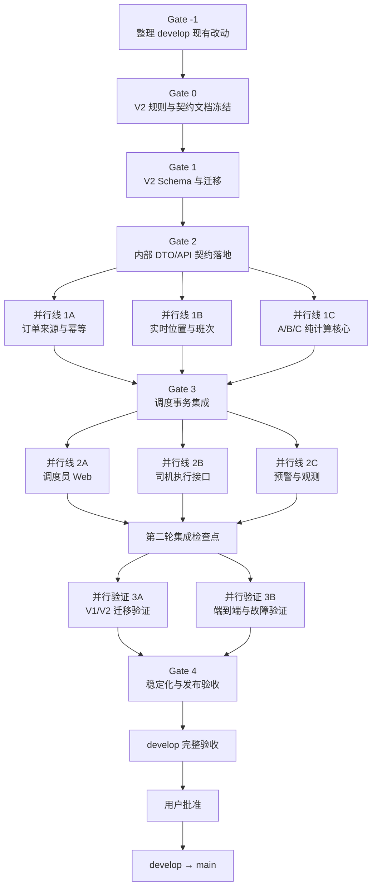
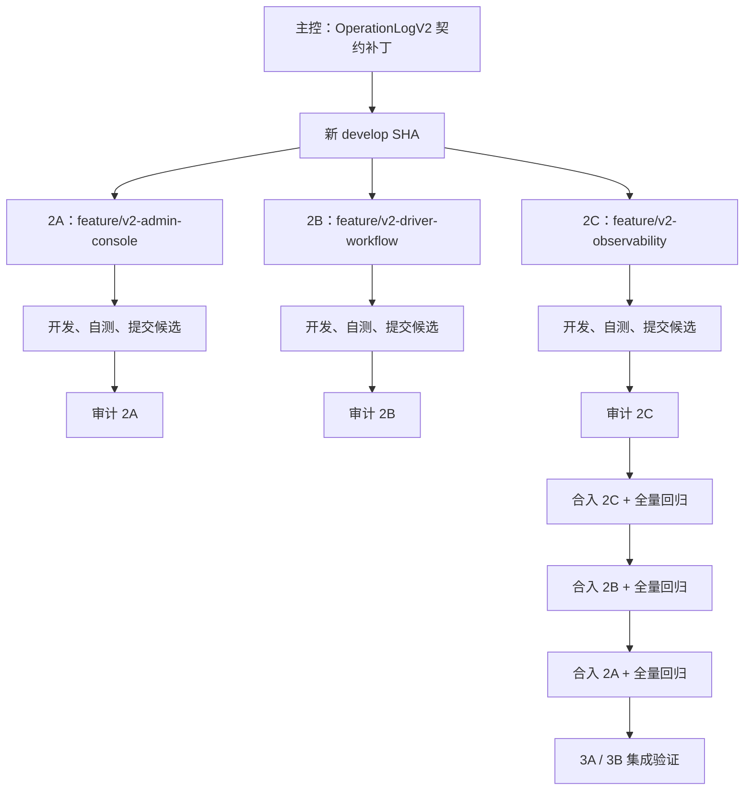

# PRD V2 并行开发与分阶段验收设计

> 文档版本：`RCD-V2-PARALLEL-DESIGN-20260713`
> 状态：总体架构已批准；Gate -1～Gate 3、第二轮、P2、3A/3B 与 Gate 4 已完成。G4-5 已部署 `4d370d6…@sha256:508dea…453d` 并完成 T5/T6；主控以一次性维护窗口例外裁决 `FINAL_PASS_WITH_CONTROLLER_EXCEPTION`，Gate 4 `PASS`。R62 冻结子阶段证据与治理提交分层纪律；本轮只更新文档，不提交、不推送或操作外部系统。
> 产品主线：`docs/versions/v2.0/prd-v2.md`
> 数据主线：`docs/versions/v2.0/data-architecture-v2.md`
> 规则主线：`docs/versions/v2.0/project-rules-v2.md`

## 1. 目的

本设计用于组织人车单系统从 V1 向 PRD V2 的兼容演进。开发由用户在新的命令行界面中调用外部编码工具完成；本项目 Codex 负责阶段边界、代码一致性、数据安全和业务验收。

执行原则：

- V1 继续可运行，不另起炉灶重写。
- 先冻结文档、Schema 和公共契约，再启动并行开发。
- 一个 worktree 对应一个目标和一组独占文件。
- 每轮开发结束后停止推进，由 Codex 验收。
- 只有上一轮验收通过，才能创建下一轮分支和 worktree。
- 任何工具都不得绕过 `feature/* → develop → main`。

## 2. 已确认的基础假设

- 正式应用代码当前位于 `feature-admin-workflow/`，本计划不迁移或重命名该目录。
- PRD V2、数据架构 V2 和项目规则 V2 高于 V1 业务规则。
- `AGENTS.md` 中不冲突的技术栈、分支、worktree、API、日志、命名和测试纪律继续有效。
- V1 状态、类型和接口在兼容窗口内保留，删除前必须完成迁移验收并获得用户批准。
- 车辆继续展示，但不得进入 V2 候选过滤、评分或迟到判断。
- 外部订单字段只存在于 Adapter 和来源事件层。
- PostgreSQL/RDS 保存业务事实；Redis/Tair 保存实时或短期数据。
- 并行实现最多三条开发线，另保留一条主控线负责协调和验收。

## 3. 总体并行架构


```mermaid
flowchart TD
    A["Gate -1<br/>整理 develop 现有改动"] --> B["Gate 0<br/>V2 规则与契约文档冻结"]
    B --> C["Gate 1<br/>V2 Schema 与迁移"]
    C --> D["Gate 2<br/>内部 DTO/API 契约落地"]

    D --> E1["并行线 1A<br/>订单来源与幂等"]
    D --> E2["并行线 1B<br/>实时位置与班次"]
    D --> E3["并行线 1C<br/>A/B/C 纯计算核心"]

    E1 --> F["Gate 3<br/>调度事务集成"]
    E2 --> F
    E3 --> F

    F --> G1["并行线 2A<br/>调度员 Web"]
    F --> G2["并行线 2B<br/>司机执行接口"]
    F --> G3["并行线 2C<br/>预警与观测"]

    G1 --> W["第二轮集成检查点"]
    G2 --> W
    G3 --> W

    W --> H1["并行验证 3A<br/>V1/V2 迁移验证"]
    W --> H2["并行验证 3B<br/>端到端与故障验证"]

    H1 --> I["Gate 4<br/>稳定化与发布验收"]
    H2 --> I
    I --> J["develop 完整验收"]
    J --> K["用户批准"]
    K --> L["develop → main"]
```

Gate 2 本身不是并行阶段。只有 Gate 2 已合入 `develop` 且验证通过，第一轮三个并行 Agent 才能启动。

## 4. 串行闸门

### 4.1 Gate -1：基线整理

目标：将当前 `develop` 恢复为可运行、可追溯、可作为 V2 分支基线的状态。

工作内容：

- 盘点 `develop` 中所有已修改、已删除和未跟踪文件。
- 为每项改动确认来源、阶段归属和保留方式。
- 不覆盖、不删除、不擅自暂存用户已有改动。
- 将有效改动提交到正确分支，再按规则合入 `develop`。
- 处理嵌套 worktree 或子目录的脏状态。
- 验证 V1 当前基线仍可运行。

退出条件：

- `develop` 工作区干净。
- 当前基线的测试、检查和生产构建通过。
- V2 文档分支符合 `feature/*` 命名。
- 当前基线提交 SHA 已记录。

### 4.2 Gate 0：V2 规则与契约文档冻结

建议分支：`feature/v2-baseline`

允许范围：

- `AGENTS.md`
- `docs/versions/README.md`（文档注册表与权威顺序入口）
- `docs/versions/v1/README.md`（V1 历史索引的链接修复）
- `docs/versions/v2.0/**`
- `docs/superpowers/specs/**`

交付内容：

- PRD V2、数据架构 V2 和项目规则 V2 的版本入口。
- V2 领域词汇、订单生命周期和调度规则。
- `CanonicalOrder V2` 文档契约。
- V2 API 契约。
- V1 → V2 状态和数据兼容映射。
- V2 worktree 白名单和共享文件所有权。
- 位置有效性、可行性、ETA 缓存、采样和重排触发口径。

退出条件：

- 不存在未解决的占位符、相互矛盾或双重解释。
- `AGENTS.md` 明确区分继续有效的工程铁律和已被 V2 覆盖的业务规则。
- 本阶段不修改 `.ts`、`.tsx` 或 `.prisma`。
- 文档审查通过并合入 `develop`。

### 4.3 Gate 1：V2 Schema 与迁移

建议分支：`feature/v2-data-model`

独占范围：

- `feature-admin-workflow/prisma/schema.prisma`
- `feature-admin-workflow/prisma/migrations/**`
- `feature-admin-workflow/prisma/seed.js`

交付内容：

- 扩展 `Order`、`Driver`、`Assignment` 和 `OperationLog`。
- 新增 `OrderSourceEvent`、`DriverShift`、`OrderServicePlan`、`DispatchAlert` 和 `DriverLocationSample`。
- 增加计划顺序、`planVersion`、计划时间、锁定和执行时间字段。
- V1 数据兼容策略、迁移 SQL 和 rollback SQL。
- 与 V2 场景匹配的种子数据。

退出条件：

- Prisma Schema 校验通过。
- 迁移 SQL 已人工审查。
- 正向迁移和回滚演练通过。
- V1 数据无丢失，关键表数量和关键字段核对通过。
- 未修改页面、API Route 或调度业务逻辑。

### 4.4 Gate 2：内部 DTO/API 契约落地

建议分支：`feature/v2-contracts`

独占范围：

- `feature-admin-workflow/src/types/v2/**`
- `feature-admin-workflow/src/lib/contracts/v2/**`
- 经批准的统一响应契约小改

交付内容：

- `CanonicalOrderV2`。
- 执行状态、可行性、锁定和计划顺序类型。
- 调度输入、输出和事件类型。
- 位置、ETA、预警和服务模块 DTO。
- 并发冲突、非法流转和外部依赖故障错误契约。
- 契约测试与固定测试夹具。

退出条件：

- 无 `any` 和重复业务类型。
- 外部字段未扩散到调度 DTO。
- 车辆字段未进入调度输入。
- API 返回 `{ success, data, error, traceId }`。
- 并发冲突返回 409 和当前 `planVersion`。
- 非法流转返回 400，并包含 `currentStatus` 和 `targetStatus`。
- Gate 2 合入 `develop` 后全量验证通过。

## 5. 第一轮并行开发

三个分支必须从 Gate 2 合入后的同一个 `develop` SHA 创建。

### 5.1 并行线 1A：订单来源与幂等

建议分支：`feature/v2-order-source`

独占范围：

- `feature-admin-workflow/src/lib/adapters/order-source/**`
- 经契约冻结的订单接入 API
- `OrderSourceEvent` 入库实现

验收标准：

- 完整实现 `validate → normalize → map → CanonicalOrder`。
- 使用 `(sourceSystem, externalOrderId, sourceVersion)` 幂等。
- 相同版本返回已有处理结果。
- 新版本更新订单快照并保存来源事件和前后值。
- 单条失败不阻断整批，逐条错误包含 traceId。
- 外部原始状态不直接写入内部执行状态。
- 外部 API 故障不影响已进入内部系统的订单。

### 5.2 并行线 1B：实时位置与班次

建议分支：`feature/v2-realtime-location`

独占范围：

- `feature-admin-workflow/src/lib/location/**`
- `feature-admin-workflow/src/lib/shifts/**`
- 经契约冻结的位置和班次 API

验收标准：

- 只有已上班、位置有效且可用的司机参与调度。
- 位置包含采集时间和精度。
- 过期位置明确标注并排除调度。
- Redis/Tair 保存最新位置和在线状态，数据库保存班次与采样历史。
- 执行中司机不能下班。
- 下班释放所有尚未出发任务。
- Redis/Tair 故障时不伪造实时位置。

### 5.3 并行线 1C：A/B/C 纯计算核心

建议分支：`feature/v2-dispatch-core`

独占范围：

- `feature-admin-workflow/src/lib/dispatch-v2/core/**`
- 纯算法测试与夹具

验收标准：

- 每名司机只规划 A/B/C。
- 优先处理承诺取车时间更早的订单。
- 排除预计迟到超过 30 分钟的组合。
- 可行组合优先衔接 ETA 最短的司机和位置。
- 尊重 `AUTO_FROZEN` 和 `MANUAL_LOCKED`。
- 车辆不参与过滤、评分或迟到判断。
- 核心算法不直接访问 Prisma、Redis、HTTP 或 API Route。
- 固定输入产生确定性输出，边界场景有单元测试。

#### 1C 第三轮复核裁决（2026-07-19）

复核结论：1C FAIL，发现 2 个 P0 + 1 个 P1 调度正确性缺口。返修规则已批准，实施记录如下。

**P0-1 订单池白名单**：订单池只接受 `UNASSIGNED` 与本轮明确释放的 `PLANNED` Assignment 对应订单。`EN_ROUTE / IN_SERVICE / COMPLETED / CANCELLED` 不得因 Assignment 快照缺失而入池。复用已实现但主流程未调用的 `filterDispatchableOrders()`。

**P0-2 COMPLETED 工单退场**：`COMPLETED` Assignment 从 `isImmobile` 保护名单移除；分类循环最前面做终态短路丢弃（`COMPLETED` / `CANCELLED`），不进入 seqMap、proposal 或 cursor 推进。`EN_ROUTE / IN_SERVICE` 继续保护。`MANUAL_LOCKED + COMPLETED` 也丢弃——锁不能复活终态。反转既有 `"COMPLETED assignment is immobile (never released)"` 测试。

**P1 多槽遍历择优**：`findBestSlot` 遍历每名司机全部开放槽位，对每个 `(driver, seqNo)` 组合独立计算 cursor、slack 与 laterImmobileBound。择优比较器 `(deadheadMinutes, driverId, seqNo)` 字典序。PRD V2 §6.2 第三条「在可行组合中优先选择衔接 ETA 最短的司机与槽位」要求比较所有可行司机-槽位组合，修复后满足。

**返修接受条件**：至少 3 个回归场景——孤立 `EN_ROUTE / IN_SERVICE` 不入池、`COMPLETED` 不占槽（含 `MANUAL_LOCKED + COMPLETED` 仍丢弃）、A 不可行但 C 可行时选择 C。通过后进入 1C 终审。

## 6. 调度集成闸门

### 6.1 Gate 3：调度事务集成

建议分支：`feature/v2-dispatch-integration`

前置条件：第一轮三条并行线依次合入 `develop`，每次合并后均通过全量验证。

独占范围：

- `feature-admin-workflow/src/lib/dispatch-v2/application/**`
- `feature-admin-workflow/src/lib/dispatch-v2/repositories/**`
- 经契约冻结的调度 API 和事件触发器
- 仅为实现“业务事实 + 调度 outbox 同事务提交”而批准的 1A/1B 业务写入点精准改动；不得借此重构 Adapter、位置或班次模块

**Gate 3-3 范围冻结（2026-07-26）**：G3-3 仅完成调度应用编排、Redis/数据库锁、事务提交，以及过期快照、幂等和并发验收；ETA 矩阵正确性是编排前置条件，必须覆盖本轮新规划订单产生的 delivery cursor。G3-3 继续使用 `feature/v2-gate3-review-remediation`，不另建分支，不进入第二轮 Web、司机执行或观测功能。

**Gate 3 最小 E2E 入口例外（2026-08-09，当前有效）**：为完成已经获批的上海
`G3E2E` 真实业务验收，允许在唯一候选
`codex/v2-gate3-app-candidate` 上串行补齐 API 契约 V2 已冻结、但候选代码尚缺的最小
入口：修正绑定司机账号登录后返回司机 H5；复用现有司机会话调用
`POST /api/v2/driver/shift/start`，不在 Gate 3 新增 H5 上下班按钮；补齐司机本人
`depart / arrive / complete` 与调度员 `reassign` 路由、同事务业务事实/outbox、
`planVersion`、Redis/数据库锁、鉴权、幂等、非法流转和并发反例。该例外不得新增页面、
Schema、migration、枚举、DTO、依赖或观测功能，不得实现契约外功能，也不得据此启动
第二轮并行。完成本地全量回归、新 SHA/镜像/ECS 更新后，方可投递冻结的 10 单并执行
手工改排验收。

**Gate 3 两台真实设备 / 门店账号串行执行覆盖（2026-08-10，当前有效）**：本轮真实业务
验证的运行基线固定为 `958afca537b412fb972b6e180561a9b37022834d`，ACR index digest 为
`sha256:13e0f3c4c10599867bc8a956f9332890826edcebdbc00cef9ec826fca2415bff`；ECS app、worker
已按该 digest 运行，Nginx 仅刷新相同 revision，原镜像、配置、证书和端口未变。五个冻结
司机账号的 H5 登录、自动上班和链路可达结论继续有效；受真实设备数量限制，本轮只使用
两台 iOS Safari 真机，手机 1 保持司机 01，手机 2 按场景依次切换司机 03、司机 05。
司机 02 的既有真机位置只作为失败现场证据，不再承担跨门店自动调度目标；不得把三个
账号的串行覆盖表述为三台或五台真机覆盖。该安排只修正验收执行拓扑和目标司机映射，
不改变产品行为、API、数据模型、门店边界或冻结订单内容。

串行映射与证据要求：

- 冻结订单 1～3（`NORMAL_ABC`）映射司机 01，保存 A/B/C 计划证据后依次执行
  `depart / arrive / complete`，释放后续容量；
- 冻结订单 4～6（`AT_RISK_ABC`）映射七莘门店司机 03，真实 E2E 执行目标 slack 依次为
  `-5 / -15 / -25`，保存 A/B/C 与风险证据后依次执行完成，释放后续容量；第 6 单的
  `-25` 只为真实高德重复调用保留 5 分钟抖动余量，不改变产品 `-30` 分类阈值；
- 冻结订单 7（`INFEASIBLE_ALERT`）映射司机 01，必须验证不可行结果及对应 `OPEN` 预警；
- 冻结订单 8～9（`MANUAL_REASSIGN`）先映射浦东门店司机 05，再以司机 01 为人工改排目标：
  到达前验证至少一次成功改排，同时验证并发/旧版本冲突；到达后改排必须被拒绝；
- 冻结订单 10（`INGEST_IDEMPOTENCY`）映射司机 05，以相同 `sourceVersion` 重放并验证
  不产生第二份业务事实或第二次副作用。

每个场景开始前，目标门店司机必须在真实 iOS H5 中产生上海范围内、采集时间不超过 120 秒、
精度不大于 100 米的位置；为使按门店加载全部活动司机的自动调度目标可判定，普通单司机
场景只保持订单所属门店的目标司机位置新鲜，手工改排场景则同时刷新司机 05 与司机 01。
十个冻结订单的 ID、地址、车牌和业务类型保持
不变，承诺时间仅可按当前时间与真实高德 ETA 推导，不得伪造坐标或 ETA。每组须在执行
完成、释放容量前先保存调度计划、时间轴、预警和 trace 证据。

用户可在现有调度员 Web 中同步观察地图、订单和时间轴；由于第二轮调度员 Web 仍冻结且
现有页面没有 V2 改排按钮，本轮由验收 Agent 通过已冻结的 V2 API 执行手工改排和并发
请求，不得把该结果表述为“Web 改排按钮已覆盖”。原始 E2E 数据包及 checksum 必须保持
只读；若提交脚本要求去除手工改排批次的 `.blocked` 后缀，只能在独立证据目录创建内容
哈希相同的运行副本，并记录源文件、运行副本 SHA-256 和上述运行基线，禁止篡改旧的
`EXPECTED_REVISION` 或原包。

本覆盖追加失败判定：自动调度组的目标账号不属于订单所属门店，或任一过期、低精度、
非上海位置被当作有效位置；A/B/C 目标、顺序或
可行性与冻结预期不符；不可行订单无 `OPEN` 预警；幂等重放产生重复事实/副作用；并发或
旧 `planVersion` 被错误接受；到达后改排成功；原始数据包被修改；直接写业务数据库；
伪造 ETA、时间或坐标；把两台真机、三个串行账号覆盖表述为三台或五台真机覆盖；任一回归测试失败，均判定本轮
`FAIL`。

**2026-08-10 执行进度**：运行基线 `958afca…` 下，订单 1～3 已由司机 01 形成 A/B/C
`NORMAL` 计划并完成 `depart / arrive / complete`，开放预警为 0；对应真实上海位置、
六次真实高德路线调用、接入 trace 与 outbox 清空证据已保存。订单 4～6 首次仍按旧映射使用
司机 02；虽然位置和真实 ETA 有效、接入 `3/3` 成功，worker 也消费了三个事件，但司机 02
属于虹桥门店，订单属于七莘门店，故按数据架构规定未进入候选集合，最终没有 Assignment 或
Alert。该次执行按冻结规则停止并保留为拓扑失败证据，不清理、不直接改库；订单 4～6 使用
相同 external ID 和递增 sourceVersion，待手机 2 登录司机 03 并刷新真实位置后重试，订单
7～10 尚未在本轮投递。详细证据见
[2026-08-10 真实 E2E 重验进度](../../status/2026-08-10-gate3r-real-e2e-retest-progress.md)。

**Gate 3 真实 E2E 边界样本修正（2026-08-10，当前有效）**：司机 03 在七莘门店内产生
新鲜上海位置后，订单 4～6 已完成两次真实高德尝试。第二次收紧到 ETA 时位置年龄 `27s`、
精度 `4.6m`，六次路线调用均一次成功，接入 `3/3` 成功；订单 4、5 分别形成 A/B 且为
`AT_RISK`，实际 slack 为 `-6 / -16`，第 6 单则为 `INFEASIBLE / -31` 并产生 `OPEN`
预警。生成脚本对第 6 单使用恰好 `-30` 的边界目标，而调度引擎重新调用真实高德时，前序
路线相对生成阶段多 `1` 分钟，累计把第 6 单推到 `-31`。该结果说明产品分类正确，但边界
样本不适合作为非确定的真实高德 E2E 成功夹具。

经用户批准，第 6 单真实 E2E 目标 slack 调整为 `-25`；产品 `-30` 分类阈值、API、Schema、
枚举、订单 ID、地址、车牌和业务类型均不变，原始 ZIP、manifest 与 SHA-256
`cfa37d9059a4861e9d07084b67d13eaaba421843879932c3665e82b9365cef50` 继续只读。执行时只能在
新的独立证据目录为第 6 单叠加 `-25` 运行时承诺时间，并记录覆盖值与校验和；精确 `-30`
边界继续由确定性自动化测试验收。重试通过条件为订单 4～6 均形成司机 03 的 A/B/C，实际
slack 全部满足 `-30 <= slack < 10`、状态均为 `AT_RISK` 且无 `OPEN` 预警；否则立即停止，
不得执行司机完成动作或清理既有失败事实。

**Gate 3 H5 最小显示返修登记（2026-08-09，当前有效）**：在不新增页面、DTO、Schema、
migration、枚举或依赖的前提下，允许现有司机任务详情按 `businessType` 条件隐藏无关导航
入口：`STORE_PICKUP / DOOR_DELIVERY` 只显示“导航前往取车”，`STORE_RETURN /
DOOR_PICKUP` 只显示“导航前往还车”；被隐藏入口不得留下坐标缺失占位。H5 展示值若以
`[G3E2E]` 开头，整项不渲染但不得修改底层事实或审计证据；后续 Web 必须遵守同一展示规则。
实现时须追加四类订单组件用例、坐标缺失反例和测试标记过滤用例，并回归司机鉴权、位置上报、
任务列表、`depart / arrive / complete` 与全量测试。导航条件错误、测试标记泄露、底层数据被
改写或任何既有回归失败，均判定返修 `FAIL`。

**生产平台纠偏（2026-07-29，当前有效）**：Railway 曾被批准从临时 Demo
升格，但该结论随后由 Gate 3-R 基建裁决替代。Railway 部署、真实 Redis 竞争和
周期 worker 记录继续作为历史运行证据，不再定义生产架构、发布步骤或 Gate 3
剩余阻断。阿里云是目标生产主线；尚未完成的资源、网络、部署和运维能力不得
写成已经具备。应用/worker 必须保持平台无关，生产实施另按 Gate 3-R 文档验收。

交付内容：

- Redis/Tair 调度短锁。
- `planVersion` 乐观锁。
- Assignment 数据库事务提交。
- 独立 `DispatchEventOutbox`、稳定事件 ID、消费租约、退避重试与周期补偿入口；不得复用 `OrderSourceEvent` 存内部事件。
- 高德 ETA 预筛、缓存和不可用处理。
- 新订单、订单变化、位置变化、班次变化、执行事件和模块变化触发局部重排。
- `DispatchAlert` 创建、更新和解决。
- 自动重排与人工修改版本日志。

退出条件：

- 旧计算不能覆盖新计划。
- 重复事件不会产生重复排程或重复派单。
- 到达后服务端拒绝改派。
- 高德失败返回 ETA 不可用，不使用假 ETA 或演示数字。
- 锁、版本验证、Assignment、预警和日志在一致的事务边界内提交。
- 并发和状态流转测试通过。

Gate 3 只能由单一实现线完成，禁止多个 Agent 同时修改调度提交事务。
Gate 3 若因事务 outbox 必须修改上游业务写入点，仍由同一实现线串行完成，
且每处改动只能把事件入队纳入原业务事务并补测试；Schema/契约勘误须同步
迁移、rollback 和权威文档，形成可审计的受控例外。

## 7. 第二轮并行开发

三个分支必须从串行前置任务合入后的同一个、经主控批准的 `develop` SHA 创建。

### 7.0 串行前置：契约与调度员 V2 API 接线

第二轮并行前按以下顺序串行完成，不得与 2A/2B/2C 同时施工：

1. **司机 H5 再冻结**：以 PRD §9.2.2 和 API 契约 §2.2/§3.7 为准；Gate 3 已验收的单一导航入口、`[G3E2E]` 展示过滤、位置同源快照和司机鉴权不得回退。
2. **调度员 V2 API 接线**：13 个唯一 URL 中，本任务拥有除 `/api/v2/alerts`、`/api/v2/logs` 外的 11 个路径；其中现有 `reassign` 只做一致性复验，其余缺口按冻结契约实现。`alerts/logs` 仍由 2C 唯一拥有。
3. **V1 兼容保留**：本任务不删除、不重命名、不复用 V1 路由。V1 写/读退出严格按兼容矩阵 §7 的两个独立时点执行。
4. **集成验收**：统一响应、鉴权、分页、错误码、`traceId`、乐观锁、事务副作用和契约测试通过；不修改 Schema、migration、调度核心、司机 H5 页面、共享样式或观测独占文件。

串行分支：`feature/v2-dispatcher-api-wiring`，worktree 为 `.worktrees/dispatcher-api-wiring`；正式基线为本轮状态同步提交，完整 SHA 由主控任务卡登记。该分支对齐基线后实施；合入并完成全量 test/lint/build 后，主控记录新的本地 `develop` 完整 SHA，才允许创建三条并行分支。

**2026-08-16 审计返修前置**：`feature/v2-dispatcher-api-wiring @ 319f73401359ef4a232a2217afaaef2ef4212af2` 因 outbox CHECK、人工计划完整性、地址重编码、跨门店释放和严格版本冲突缺口判定 `FAIL`，不得合入或进入正式测试。API r15 先冻结完整人工计划与三项读 DTO；数据模型唯一所有者随后从主控登记的新基线创建 `feature/v2-dispatch-event-constraint`，只新增 `20260816120000_extend_dispatch_event_outbox_types/migration.sql` 与同目录 `rollback.sql`。独立 migration 通过后合入 `develop`，API 返修分支再基于新 SHA 继续；审计 Agent 只复审，测试 Agent 在二审通过前保持等待。

**2026-08-16 数据模型退出与 API 重放闸门**：`feature/v2-dispatch-event-constraint @ c6850df0a85aab601c3034e542a0f0b575c9053e` 已完成隔离 PostgreSQL 的 Forward → Rollback 阻断 → 安全 Rollback → Forward、Prisma 零漂移和全量回归，并快进进入本地 `develop`；预生产保持 9 个 migration。API r16 把依赖枚举笔误统一为共享 DTO 的 `AMAP`。应用返修候选 `5b84ab4881e1a8da12672c19d87098674798e60c` 必须从主控登记的新代码/文档基线重放 `319f734…` 与 `5b84ab4…`，随后只新增 `driver-command-service.ts` 及其测试的跨门店释放返修；禁止直接把 migration cherry-pick 到旧候选。

**2026-08-16 T1 正式测试闸门（冻结）**：唯一候选为 `feature/v2-dispatcher-api-wiring @ 152f7c5142131a030be560a863285eb6d32d0a2f`，正式代码基线为 `0e8ea7fc70d523de2cfa81173f1a421cad16ade7`；`60f03af3c73bb867a7139b705741135d276b50ab` 已废止。T1 分两段执行：

1. **T1-A 本地只读验收**：重核分支、HEAD、基线与 `c6850df…` 祖先链、27 文件白名单和干净工作区；执行全量 `pnpm test`、`pnpm lint`、`pnpm build`、`git diff --check`，并核对 12 个操作的 401/403、传入 traceId、缺省 UUID，主要 400/404/409/503 的 body/header traceId，一致的 `modificationHistory`、分页、幂等零副作用、Redis 与高德 mock 故障矩阵。测试 Agent 不修改任何跟踪文件。
2. **T1-B 隔离 PostgreSQL 验收**：必须另获主控授权后，才可在本机隔离 PostgreSQL 18 临时实例执行；验证第 10 个 migration 后 CHECK 精确允许 17 种事件，并建立一名司机、两个不同门店 `PLANNED` 工单执行停派：两个 Assignment `RECYCLED`、两个订单 `UNASSIGNED`、司机版本只增一次、日志 `1+2`、outbox 两条且四类 ID 完整、消费范围覆盖两个订单门店。重复 availability 零副作用；outbox 或日志写入失败时事务整体回滚。禁止连接预生产 RDS/Tair、真实高德或云服务。
3. **T1 退出**：T1-A 与 T1-B 均通过、候选 SHA 不变、工作区仍干净，才可由主控裁决 `--no-ff` 合入；若仅 T1-A 通过，状态只能记为 `T1-A PASS / T1-B PENDING`。合并后必须再跑全量验证并记录新的 `develop` SHA，之后才能授权 2A/2B/2C。

**2026-08-16 T1 退出结论**：T1-A 为 `623 passed / 7 expected skipped`，lint、build、diff check 和边界核验通过；T1-B 在本机 PostgreSQL 18.3 `127.0.0.1:55437` 顺序应用 10 个 migration，确认 outbox CHECK 精确允许 17 种事件，并通过跨门店停派、幂等零副作用、日志/outbox 失败整体回滚。候选 SHA 保持 `152f7c5…`，随后以 `--no-ff` 合入本地代码锚点 `8cfed6ad9464cc89acca69bbbae42af5d66b01c6`；合并后再次通过 `623/7`、lint、29/29 页面 build、diff check 和干净工作区。未推送，未连接预生产或云服务；2A/2B/2C 为 `AUTHORIZED / NOT_STARTED`，必须从主控下发的当前本地 `develop` HEAD 创建，该 HEAD 同时包含上述代码树和新的文档基线。

**2026-08-16 第二轮契约补丁**：`develop @ f591aca69e9f6e4a20061c94ea564b053abe7be0` 新增共享 `OperationLogV2`，冻结 `/api/v2/logs` 为 `PageResultV2<OperationLogV2>`、结构化前后值字段白名单和原始 `metadataJson` 禁止暴露边界；专项 `9/9`、全量 `624/7`、lint、29/29 页面 build 和 diff check 通过。三个并行分支/worktree 已从该代码锚点登记，开工前必须统一快进到包含本次治理文档的同一最终 `develop` HEAD。

**2026-08-17 第二轮执行快照**：三条线均从统一本地 `develop @ f44afac43282463cd9d7cce9e13668feedf8a133` 开始。2A 保持实现中且尚未提交；2B 已形成 `c1279b5078d4ea3628f5931055abe27095519227`，司机专项 `48/48`、全量 `639/7`、lint、build、白名单和 diff check 通过，API r18 的 `DriverTaskV2.servicePlan` 只在该候选内，下一步是只读代码审计与 `360×800`、`390×844` 浏览器验收；2C 已形成 `99d69095c69e73320174b52c6e4e61319d8a3cc8`，专项 `26/26`、全量 `641/7`、lint、build、白名单和 diff check 通过，下一步是只读代码审计与独立测试。任何一条线在各自审计和测试完成前均不得合入 `develop`。

**2026-08-23 2A 候选快照**：`feature/v2-admin-console @ 6562544361b29579b4e52c059ce8f85db7b72722` 相对统一本地代码基线精确 14 个文件，返修提交精确 6 个文件；专项 `41` 项、全量 `665/7`、lint、31/31 build 和 diff check 通过，工作区干净。代码审计与 Chrome/Edge × 100%/125% 浏览器矩阵均 `PASS`；地图、订单池和 A/B/C 时间轴同屏、慢响应隔离、未知计划禁止空闲、详情失败恢复、人工操作入口及 125% 布局均通过。本地 Mock、一次性 PostgreSQL 和端口已清理，候选无需返修、amend 或 rebase，状态为 `EXIT_PASS / MERGE_QUEUED_3`。

**2026-08-24 2A 新基线审计快照**：旧候选 `6562544361b29579b4e52c059ce8f85db7b72722` 的两个提交无冲突重放到 `develop @ f3d68171826c20a849b9a8ca3d6bb5970e9ba49a`，形成唯一新候选 `feature/v2-admin-console @ 1c4f9f29e890360e1439bf0d0962d3ccb5f73b56`。稳定 patch-id `7c758ab98580b1362ba715d023afb7d076847488`、精确 14 文件边界与旧候选一致；全量 `715 passed / 7 expected skipped`、lint、31/31 build、diff check、干净工作区和独立代码审计通过，无新增 P0/P1。由于运行基线新增 2C、2B，仍须完成 Chrome/Edge 浏览器重点复验；当前状态为 `CODE_AUDIT_PASS / AUTOMATED_TEST_PASS / BROWSER_RETEST_PENDING`，不得合入。

**2026-08-23 2C 退出与合入快照**：原候选 `99d69095c69e73320174b52c6e4e61319d8a3cc8` 因 develop 已包含后续治理提交，先以相同稳定 patch-id 线性重放到 `1e837829…`，修正提交说明后形成 `feature/v2-observability @ 04aba1798b9ea1d834da56f5e072f936543bafc1`。候选精确 9 个独占文件，专项及共享契约 `35/35`，合入前后全量均为 `648 passed / 7 expected skipped`，lint、29/29 build、diff check 和干净工作区通过；随后 `--ff-only` 合入本地 develop，未推送、部署或连接外部系统。2B 必须等本轮治理文档提交后，再以新的 develop HEAD 为 rebase 目标。

**2026-08-24 2B 重放、退出与合入快照**：2C 治理提交形成 2B 起始基线 `develop @ 2adae769caae1dce7f994de1d1ce63ab75b0fc36` 后，2B 直接重放为唯一候选 `feature/v2-driver-workflow @ 143a10a2aeff5ebacd1397a73a82d0ae3484a8da`，其直接父提交为该正式基线，相对基线精确 29 个文件。专项 `80/80`、2B/2C 联测 `29/29`、全量 `674 passed / 7 expected skipped`、lint、29/29 build、diff check、干净工作区和独立代码审计通过；Chrome 151、Edge 151 × `360×800`、`390×844` 浏览器矩阵随后全部 `PASS`。主控按批准以 `--no-ff` 合入，形成 `develop @ 2a62162016f6967bc0a57b45ab1a6e4b8543bdac`，两个父提交为 `ef07d09…` 与 `143a10a…`；合入后全量、lint、29/29 build、diff check 和干净工作区再次通过。当前状态为 `MERGED_LOCAL / POST_MERGE_PASS`。GPS 状态缺少 live region、部分样式未完全使用设计 token 两项非阻断 P2 延至 2A 合入后的联合联调、进入 3A/3B 前处理。

**2026-08-24 2A 浏览器复验、退出与合入快照**：新候选 `feature/v2-admin-console @ 1c4f9f29e890360e1439bf0d0962d3ccb5f73b56` 在 Chrome 151、Edge 151 × 100%/125% 四组矩阵完成 28 组关键场景，慢响应隔离、未知计划禁止空闲、详情失败恢复、布局、操作入口、地图失败降级和干净控制台全部 `PASS`，无新增 P0/P1。主控随后以 `--no-ff` 合入，形成 `develop @ 46813c3ecf4a0df1eaf99bfb3d8d72f7d450193b`，两个父提交为 `5218f35…` 与 `1c4f9f29…`；合入后全量 `715 passed / 7 expected skipped`、lint、31/31 build、diff check 和干净工作区再次通过。2A 状态为 `MERGED_LOCAL / POST_MERGE_PASS`，第二轮三条开发线均已合入；两项非阻断 P2 转入联合联调，关闭前不启动 3A/3B。

**2026-08-24 P2 联合联调返修闸门**：主控批准单一分支 `feature/v2-round2-p2-remediation`、worktree `.worktrees/round2-p2-remediation`。精确白名单仅为 `driver-gps-tracker.tsx`、对应测试、`driver-workspace.tsx`、对应测试。P2-A 为 GPS 状态文字的 polite live region，30 秒时间戳必须在播报区外；P2-B 仅把白名单组件中已有语义颜色、表面和边框收口到 `globals.css` 既有 token。禁止修改 `globals.css`、页面布局、文案、业务行为、API、共享 DTO、Schema、调度核心、依赖或云资源。开发 Agent 只提交候选，不自行宣布退出；必须再经过独立代码审计、全量 test/lint/build、diff check 和 Chrome/Edge × `360×800`、`390×844` 复验，全部通过后才可合入并启动 3A/3B。

**2026-08-25 P2 代码审计与浏览器授权快照**：正式代码基线为 `develop @ 446a36f16a5fcbc0e55b13be164c9108cac0403f`。首个候选 `d05a78a…` 的 live region 通过，但小字号 token 组合对比度不足，未放行浏览器矩阵；同一分支追加最小返修后形成唯一候选 `0e354696ebe306c29b2be6ab265d4c93ff354dcc`，累计仍精确 4 文件。专项 `16/16`、全量 `717 passed / 7 expected skipped`、lint、31/31 build、diff check 和独立代码审计通过，小字号组合均达到 WCAG AA `>=4.5:1`。状态冻结为 `CODE_AUDIT_PASS / BROWSER_TEST_AUTHORIZED`；测试修改白名单为空，外部系统授权为无。测试 Agent 只能使用本地服务、隔离认证 fixture、进程级临时环境变量、API/高德 Mock、Git 忽略临时产物和截图；禁止真实数据库、Redis/Tair、高德、云服务、预生产、migration、部署、提交、推送和合并。

**2026-08-25 P2 浏览器验收、退出与合入快照**：Chrome 151、Edge 151 × `360×800`、`390×844` 四组全部 `PASS`，无 P0/P1/P2 浏览器阻断；实际视口、无横向滚动、44px 点击目标、GPS live region 与拒收原因、九组 `>=4.5:1` 对比度、Marker 联动、轮询不重置视野、地图失败降级和干净控制台均通过。主控以 `--no-ff` 将 `0e354696…` 合入本地 develop，形成 `5c2760cea40b975b24d5d2201333ab5048ce1cf0`，父提交为 `78a708f…` 与 `0e354696…`；合入后全量 `717 passed / 7 expected skipped`、lint、31/31 build、diff check、4 文件边界和干净工作区通过。P2 状态为 `MERGED_LOCAL / POST_MERGE_PASS`；3A/3B 入口条件满足但尚未启动，不继承 P2 权限。

**2026-08-27 Gate 2 兼容返修与验证重置快照**：3A 在旧统一基线 `50525878ebe2b0b01ebc63dee782371a532f7cf5` 上发现 V1 写兼容窗口缺口；唯一候选 `feature/v2-v1-write-compat-remediation @ 8fdfad7a35a287476572ef848630c23b4fd4da83` 经 Gate 2 复验 `PASS` 后，以 `--no-ff` 合入本地 `develop @ a852c4fc52005748c2f3f4f9619d44f8f7513ff8`。合入后全量 `808 passed / 7 expected skipped`、lint、31/31 build 和 diff check 通过；独立 `tsc --noEmit` 仍只有 3B 首轮已登记的 4 处测试类型债务。旧基线上的 3A/3B 结果不得作为 Gate 4 入口证据；本轮治理提交形成新统一 `BASELINE_SHA` 后，3A 重新验收，3B 先闭合 T0 稳定化返修再重新验收。

**2026-08-29 T0 与 3A/3B 退出快照**：T0 候选 `feature/v2-t0-stabilization-remediation @ 72cb11baad851f3a2fc2bf1ea6367affac679c96` 精确修改 7 个批准文件，闭合重排服务模块保留、改派错误优先级、下班真实状态和测试类型债务；代码审计与独立测试通过后以 `--no-ff` 合入本地 `develop @ 8ff70cccf29371229818058055d45de376eebdf7`。合入后 `812 passed / 7 expected skipped`、lint、`tsc --noEmit`、31/31 build、diff check 和干净工作区通过。3A 的 10 个 migration、兼容映射、rollback 与零漂移重验为 `PASS / WARN`；T0 差异未触及其权威域。3B 在与 merge commit 完全相同的代码树完成 PRD §13 14 项、隔离数据库/API、并发幂等、依赖故障、安全和 Chrome/Edge 验收，并把 worktree 快进到 `8ff70ccc…`，结论为 `PASS / WARN`。Edge 原生 125% 缩放受控制工具限制，实际登记为 `952×800` 等效布局 `PASS`；H5 `360×800`、`390×844` 为精确视口。该限制不构成代码阻断，但不得改写成原生缩放证据。

### 7.1 并行线 2A：调度员 Web

建议分支：`feature/v2-admin-console`

worktree：`.worktrees/round2-admin-console`

独占范围：

- 调度员地图、订单池、司机时间轴和前端组件
- `feature-admin-workflow/src/app/globals.css`
- V2 设计变量和全局导航

验收标准：

- 同屏展示地图和选中司机 A/B/C 时间轴。
- 地图、列表和时间轴联动。
- 时间轴区分空驶 ETA、固定模块、工单驾驶、空闲和迟到风险。
- 不可行预警至少在地图、列表和时间轴中的两处可见。
- 显示位置更新时间和过期状态。
- 支持手动派单、改派、解除锁定和修改订单时间或地点。
- 保留深色导航、灰蓝背景、暖锈强调色和克制的信息密度。
- 导航 rail 72px、工作面板 420px、控件 38px、点击目标至少 44px。
- 页面级不滚动，密集模块内部滚动。
- 状态同时使用颜色、图标和中文标签。

### 7.2 并行线 2B：司机执行接口

建议分支：`feature/v2-driver-workflow`

worktree：`.worktrees/round2-driver-workflow`

独占范围：

- 经契约冻结的司机班次、模块、出发、到达和完成 API
- Gate 3 通过后，经产品与 API 再冻结的司机 H5 高德地图、任务/位置标记和整体排版；不得
  反向扩大 Gate 3 最小 E2E 入口例外

验收标准：

- 司机只能操作自己的任务。
- 司机不能拒单或改派。
- 出发后 A 自动冻结并触发导航相关流程。
- 到达开始实际计时。
- 到达后任何角色都不能改派。
- 完成停止实际计时并触发后续重排。
- 服务模块变化立即重算后续时间轴并记录日志。
- 执行中司机不能下班。
- H5 载入实时高德地图，展示所有上班司机、本人 A/B/C 与未分配订单的获准标记；不显示
  其他司机已分配订单详情，标记与列表联动并显示位置新鲜度。
- H5 整体信息架构与移动端排版通过独立验收稿一次性调整，不在 Gate 3 期间零散改版。
- 地图 DTO、点位可见字段、刷新频率、授权边界和高德浏览器 Key/Security Code 在实施前
  已按 PRD §9.2.2 与 API 契约 §2.2/§3.7 冻结；实现不得自行增删字段或改变 15 秒读取、
  30 秒位置上报、120 秒过期与身份边界。服务端 Key 不得进入浏览器。

### 7.3 并行线 2C：预警与观测

建议分支：`feature/v2-observability`

worktree：`.worktrees/round2-observability`

独占范围：

- `feature-admin-workflow/src/lib/logger.ts`
- trace 中间件
- 预警和日志 API
- 后端观测逻辑

验收标准：

- 导入、自动排程、人工改派、订单修改和模块修改全部带 traceId。
- 自动和人工变更保存原值、新值、操作者、时间、原因和 traceId。
- `INFEASIBLE` 是持久业务对象，不是普通日志。
- 预警解决后保留历史记录。
- 禁止 `console.log`。
- API 响应头包含 `X-Trace-Id`。

所有前端导航和视觉样式由 `v2-admin-console` 统一管理，`v2-observability` 不修改共享布局。

## 8. 并行验证与最终稳定化

### 8.1 第二轮集成检查点

第二轮三条分支依次合入 `develop`。每次合并后执行全量测试、静态检查和生产构建。三条线全部通过后，才允许启动验证分支。2026-08-23 主控冻结合并顺序为 **2C → 2B → 2A**；已提前完成验收的分支必须等待队列，不得越序合入。每条分支只有在自身代码审计和冻结测试均 `PASS` 后才能进入对应合并节点。


```mermaid
flowchart TD
    A["主控：OperationLogV2 契约补丁"] --> B["新 develop SHA"]
    B --> C1["2A：feature/v2-admin-console"]
    B --> C2["2B：feature/v2-driver-workflow"]
    B --> C3["2C：feature/v2-observability"]

    C1 --> D1["开发、自测、提交候选"]
    C2 --> D2["开发、自测、提交候选"]
    C3 --> D3["开发、自测、提交候选"]

    D1 --> E1["审计 2A"]
    D2 --> E2["审计 2B"]
    D3 --> E3["审计 2C"]

    E3 --> F1["合入 2C + 全量回归"]
    F1 --> F2["合入 2B + 全量回归"]
    F2 --> F3["合入 2A + 全量回归"]
    F3 --> G["3A / 3B 集成验证"]
```

### 8.2 并行验证 3A：V1/V2 迁移验证

冻结任务卡：

- 角色：数据库验证 Agent。
- 分支：`feature/v2-migration-validation`；worktree：`.worktrees/v2-migration-validation`。
- 初始修改白名单：空。先执行只读 T0；需要新增验证脚本时，由主控另发精确文件白名单。
- 隔离候选：PostgreSQL 18.3 `127.0.0.1:55437`；实际使用前仍须确认端口、数据库身份和空库状态。
- 外部系统授权：无。禁止连接外部系统、预生产、真实 RDS/Tair 或高德。

验收标准：

- V1 状态正确映射到 V2 正交维度。
- V1 页面和接口在兼容窗口内仍可运行。
- 影子写入或双读核对通过。
- 关键表数量、字段、坐标、时间和取消状态一致。
- 当前 develop 的 10 个 migration 按序应用；rollback 保护能阻断不安全回退，安全场景可实际回退并再次 Forward。
- 最终 Prisma/Schema 零漂移，不为缺失的历史 rollback 发明替代行为。
- 更换 Adapter 不修改调度核心、Redis Key、高德和前端 DTO。

该分支只做验证脚本、报告和兼容检查。发现 Schema 问题时重新进入受控的数据模型修复分支，不直接修改已冻结 Schema。

### 8.3 并行验证 3B：端到端与故障验证

冻结任务卡：

- 角色：测试 Agent。
- 分支：`feature/v2-e2e-validation`；worktree：`.worktrees/v2-e2e-validation`。
- 初始修改白名单：空。先执行只读 T0；需要新增测试脚本时，由主控另发精确文件白名单。
- 隔离候选：PostgreSQL 18.3 `127.0.0.1:55438`、app `3048`、Mock `3049`；实际使用前仍须确认端口、数据库身份和空库状态。
- 外部系统授权：无。Redis/Tair、高德和订单源仅允许进程级或本地 Mock；禁止连接外部系统、预生产或云资源。

验收标准：

- 当前 PRD §13 的完整 14 项验收全部有自动测试或明确验证记录。
- 并发重排、重复订单、重复派单和版本冲突测试通过。
- 高德、Redis/Tair 和外部订单源故障测试通过。
- 无假 ETA、假位置或最后写入者无条件覆盖。
- API 鉴权、安全边界、统一错误和 body/header `traceId` 一致性通过。
- Chrome 和 Edge 的调度员桌面 100%/125% 与司机 H5 `360×800`/`390×844` 矩阵通过。
- 若自动化控制器无法操作 Edge 浏览器顶栏缩放，必须明确记录为等效布局宽度验收，不得伪称原生 125%；本轮等效布局为 `952×800`，结论 `PASS / WARN`。
- `pnpm test`、`pnpm lint`、`pnpm exec tsc --noEmit`、`pnpm build` 和 `git diff --check` 通过。

### 8.3.1 共同基线、启动和停止边界

- 当前验证代码基线为 `develop @ 8ff70cccf29371229818058055d45de376eebdf7`；5 份退出治理文档已形成 Gate 4 筹备来源 `develop @ f835302d555fc0481a37dfc388bf8e4e382a6230`；`origin/develop @ ae4714849fa965940b0df1c6766638cf398ac0ce`，未推送。
- 3A 为 `PASS / WARN`；3B worktree 已快进到 `8ff70ccc…` 并为 `PASS / WARN`。Gate 4 只接受主控下发的、包含本次激活同步的完整统一基线 SHA。
- 旧 `50525878…` 上的 3A Gate 2 发现与 3B FAIL 只保留为问题证据，不再代表当前状态。
- 两条线不继承旧文件白名单或外部系统授权；验证 Agent 不更新治理文档，也不得互相合并或 cherry-pick。
- 立即停止：HEAD/基线不一致、工作区不干净、端口/数据库身份/空库状态不明、需要修改 Schema/migration/API 契约/业务代码、需要外部连接/新依赖/跨域文件、权威文档冲突，或 rollback 需要删除事实绕过保护。

### 8.4 Gate 4：稳定化与发布验收

当前状态：`PASS / G4_1_TO_G4_4_PASS / G4_5_FINAL_PASS_WITH_CONTROLLER_EXCEPTION`。分支/worktree 不变，代码/RC tag/OCI revision 为 `4d370d664c3710a4a03cb1b665cfdeddc7d32778`，应用 tree `5188c0efcb96d646a9609b7c47dd624d578841ee`；T5/T6 任务文档基线为 `8f69579d041c46e9a47b0ae0bfff746fd510a5b1`，最新已提交治理文档基线为 `e4f55c8e4bff50bac646679607fb8c7c4b712c6f`。本轮不更改代码身份、不提交、不推送、不合并 develop，也不执行外部写操作。

建议分支：`feature/v2-stabilization`

只允许：

- 影响演示、迁移或发布的缺陷修复。
- 测试修复。
- 运行手册、发布说明和回滚说明。

禁止：

- 新功能。
- 新数据表。
- 大规模重构。
- 未经批准删除 V1 兼容层。

退出条件：

- 六步以上的正式演示脚本完整走通。
- 数据迁移、回滚、并发和故障场景验证通过。
- `develop` 可运行、可演示、可回滚。
- 用户批准后才允许 `develop → main`。

#### 8.4.1 Gate 4 执行快照（截至 2026-09-07）

1. **T0/G4-1 `PASS`**：初始 `feature/v2-stabilization @ 4102ee1…` 与 worktree 干净；在不安装或升级依赖的前提下完成全量 test、lint、`tsc --noEmit`、build、Prisma validate 和 diff check。工程验收矩阵、正式演示脚本草案、证据复用/重验矩阵与缺陷归属已形成。
2. **G4-2 `PASS`**：完成脱敏资源与权限盘点。ACR、ECS、RDS、Tair、SLS、Nginx、自签名证书、安全组和责任人已确认；RDS/Tair 无公网入口，数据库/Redis 无需对公网开放。SLS 告警中心与内部存储已初始化，runtime/security 分别保留 30/180 天；自签名证书已轮换至 2026-10-06，只允许预生产公网 IP 演示，不代表正式生产可信 HTTPS。
3. **G4-3 `PASS`**：2026-08-30 全量快照恢复点可用。隔离恢复库 `rcd_v2_g43_restore_20260830` 的 9 个历史 migration 与制品 checksum 匹配；第 10 个 migration 完成 Forward 后约束正确、业务行数不变，随后 rollback 与单条 migration 元数据复位恢复到 9 个。无非预期 DDL、漂移或业务数据删除，源预生产库写入为零。
4. **G4-4 首个 RC `REJECTED_DO_NOT_DEPLOY`**：SHA tag `4102ee1…`、index digest `sha256:5d9685…`、amd64 digest `sha256:c41161…` 可追溯，但精确 digest 扫描发现未裁决 Critical/High；该 tag/digest 作为失败证据保留，禁止覆盖、删除或部署。
5. **G4-4 本地返修 `PASS`**：同一分支的 `5f5104f…` 与 `c3b554e…` 只修改 Dockerfile、package/lock 和部署制品测试；Node 22/Bookworm 保持，最终镜像移除完整开发依赖，GnuTLS 达到修复版本。`812 passed / 7 expected skipped`、lint、tsc、build、专项测试、app/worker/Prisma CLI 运行探针与 Trivy 0.74.0 精确扫描通过；独立审计确认未解决 P0/P1 为 0。
6. **G4-4 历史远端 RC `REJECTED_DO_NOT_DEPLOY`**：source/tag/OCI revision `a0c8bbdc…`、index `sha256:8e671d…c541`、amd64 `sha256:de3bb4…d913`、Trivy 和 Compose 同 digest 曾通过，但随后 G4-5 T1 制品预检证明镜像内第 10 条 SQL raw checksum 是 CRLF 字节的 `4944d45a972d68d20a67708457ed733f6e00b4fbc1f72cb5acab8a05c6d1a2d7`，与 Git 制品 `ab2fd94d6d6549ee4dfcff51c744bcc76390fdff26fd26d89b928637e144759c` 不一致。该 RC 与旧 `4102ee1…` RC 都作为失败证据保留，禁止覆盖、删除或部署。
7. **G4-5 历史尝试 `T0_PASS / T1_ARTIFACT_PREFLIGHT_FAIL / BLOCKED`**：当时 T0 确认 app/worker/Nginx 为 Gate 3 `958afca…`、真实 RDS/Tair/高德 readiness 正常、单 worker 成功、outbox pending/failed=0、预生产为 9 条 migration；RDS 全量备份 ID `3143022530`，ECS 配置备份 SHA-256 `9feec1ab82cec72dc995a10e8b06f84a5014ab81e480c1a46bae6a38ded3525b`。T1 只运行了 `--network none` 制品预检，`MIGRATION_EXECUTED=NO`、`APP/WORKER/NGINX_UPDATED=NO`、`ROLLBACK_USED=NO`；此历史记录不代表新一轮 T0 已通过。
8. **G4-4 CRLF 本地返修 `PASS`**：`0c854224c703b3afaa18db2351d8bba3b263ad86` 只修改 `.gitattributes`、Dockerfile 和部署制品测试，不修改 migration SQL、Schema、API、依赖或业务逻辑。专项 5/5、全量 `813 passed / 7 expected skipped`、lint、tsc、31/31 build、diff check 通过；本地镜像 `sha256:9c771dd5ba19db1babdccbfc94ee804d7e29e77d4fdfa5537028af4d56e15c41` 内残余 CR=0、19/19 SQL raw checksum 与 Git 一致，独立审计 P0/P1/P2=0。该修复随后进入统一远端基线 `857705e…`。
9. **G4-4 统一远端 RC `TRACEABILITY_PASS / SECURITY_SCAN_FAIL / REJECTED_DO_NOT_DEPLOY`**：source/tag/OCI revision 为 `857705e810172a1e53eb1355089d51a3ad8c7632`，index 为 `sha256:79c72cc67ecf718d8ddb54e562c52c325424ce55868a3d1d79a67b0de81b9823`，linux/amd64 manifest 为 `sha256:55c444089ba7986c4cef3a41f4a9f6509cd05f3d8f55d7e39c1e9c1236cee530`。10 个 migration、19/19 SQL raw checksum、残余 CR=0、Compose app/worker/migration 同 index digest 和无 `latest` 均通过。Trivy 0.74.0 报告 SHA-256 为 `5fc07d3d33d83421d46ddc66c7c7b199ca24b7cad8c44f08511429de602c038e`；2 个唯一 Critical 已裁决不适用，仍有 2 个未裁决 P0 和 10 个未裁决 P1。独立审计结论为 `FAIL`；三个历史/当前 RC 均保留且禁止覆盖、删除或部署。执行记录未包含 ECS、RDS、Tair、SLS、Nginx、业务容器或 migration 变更，本地 Docker 事件未见业务容器启动；但没有持久化首次构建前 tag 不存在的原始证明、全程不可变 shell transcript 或独立 ECS 非部署快照，这些证据限制不改变 `FAIL` 结论。

10. **G4-4 本地安全返修与独立复审 `PASS`**：用户于 2026-09-03 批准 Debian 13 Distroless 例外及五文件返修，候选 `4d370d6…` 相对父提交 `c5e38e4…` 精确修改 Dockerfile、Compose、package/lock 和部署制品测试。Git 归档、index/manifest/config/OCI revision、19/19 SQL raw SHA、CR=0、非 root、bcrypt/Prisma/worker/app 探针通过；独立全量 `813 passed / 7 expected skipped`、lint、tsc、diff check 通过。固定 R55 库（2026-09-01）Critical/High=0，报告 SHA-256 `c3bf30b87438b62ff5eff978fb7d0c44f483f162a7174f10e73ce6adcdb49c21`；最后独立复审复用既有 31/31 构建日志和实际镜像，未重建。仅本地占位配置制品通过，未推送/部署；完整证据见[状态总览](../../status/README.md#gate-4-本地安全返修证据2026-09-03)，技术例外见 APP-006 和部署指南 §5.1。

11. **G4-4 新远端 RC `PASS`**：2026-09-03 真实配置制品 `4d370d6…@sha256:508dea…453d` 的 source/tag/index/amd64/config/OCI 链、SQL、双库及秘密扫描全部通过，独立证据审计未决 P0/P1/P2=0。主控裁决完整 G4-4 PASS；G4-5 仅入口就绪，须按下节重新授权 T0。历史第 7 项的 T0/T1 结论不被改写或续期。
12. **G4-5 当前 T0 `PASS / RECOVERY_POINT_EVIDENCE_PASS`**：2026-09-06 只读复核确认 ECS/RDS/Tair/网络边界、当前 Gate 3 运行身份、预生产 9 条 migration、outbox、数据库最小权限、owner `NOLOGIN` 与 SLS 通知链路；`OrderServicePlan` app ACL 经单独返修与独立复核通过。最新恢复点 `3149081194` 为 `Success / BackupAvailable=1 / FullBackup / Automated`，完成于 `2026-09-06T07:06:43Z`，落在当前 PITR 窗口 `2026-08-31T07:07:02Z .. 2026-09-06T09:24:50Z` 内。T0 因此 PASS；新 RC 未部署，T1-A～T6 未授权。
13. **G4-5 T1-A～T6 `FINAL_PASS_WITH_CONTROLLER_EXCEPTION`**：随后按单独授权完成配置/恢复准备、9→10 migration、app、单 worker、Nginx、真实业务/依赖/SLS 联调和 T6 独立审计。运行 source/index/OCI revision 一致，10 条 migration、CHECK 17 种、最小权限、真实 readiness、HTTPS、outbox 与恢复路径通过，未决 P0/P1=0。app/worker/Nginx 于维护窗口结束后切换，migration 绝对时间未知；主控保留原时间审计 FAIL，并只对本次预生产部署批准一次性非阻断例外。Gate 4 最终 `PASS`，但不自动授权 develop/main、推送或正式生产发布。

#### 8.4.2 新远端 RC 验收（已完成）

本节登记已另行授权并完成的远端任务，不构成部署许可。输入文档基线为 `7b6a2f472fe089b0a3dddf136b6f71f3b4a7e4f6`；source/tag/OCI revision 均为 `4d370d664c3710a4a03cb1b665cfdeddc7d32778`。源码可追溯、tag 原先不存在、Git 归档构建、真实浏览器公开配置、远端 OCI 链、SQL raw 指纹、运行探针、Compose 三角色同镜像、双库/秘密扫描和独立证据审计全部通过。

- 2026-09-03 当时主控裁决：`G4_4=PASS`，未决 P0/P1/P2=0；该时点 Gate 4 总闸门仍 `IN_PROGRESS`，后续最终状态见 §8.4.3。
- 正式 index：`sha256:508dea2dfa25da76581adc89b33d2ccf73eb91a21af26fa8f54e08fd94fe453d`。
- 正式 amd64：`sha256:577dc21e8375d1ff07af4e49100799ac6ba1b1b225968e91f3559091bc04f414`。
- 正式 config：`sha256:2930e8be2941a59fada8f8bef9614e95b83445c58e70a2f7b1337741baed8649`。
- R55 固定库与 2026-09-03 验收时点库的 Critical/High 均为 0，秘密扫描 0；不扩展为全部等级或未来漏洞结论。19/19 SQL raw SHA、CR=0，813/7、31/31 build 通过；完整报告/哈希/公开配置脱敏事件见[状态总览](../../status/README.md#gate-4-新远端-rc-正式验收与主控裁决2026-09-03)。
- 三个旧 RC 保持 `REJECTED_DO_NOT_DEPLOY`，禁止覆盖、删除或作为获准回退镜像；当前 Gate 3 运行镜像与这些拒绝 RC 分开管理，回退资格仍须验证数据库兼容性和安全风险。
- 远端验收未部署、未执行 migration；本轮五文档提交也不触发外部操作。此前 G4-5 T0/T1 与失败现场保留，旧 SHA/digest 的部署授权失效。

#### 8.4.3 G4-5 预生产继续联调方案（T6 PASS_WITH_CONTROLLER_EXCEPTION；Gate 4 PASS）

**最终状态。** `G4_5=FINAL_PASS_WITH_CONTROLLER_EXCEPTION / GATE_4=PASS`。已验收的新 RC 按 migration → app → 单 worker → Nginx 接入既有阿里云预生产，运行身份、真实依赖、业务闭环、观测、恢复和最小权限均通过。实际切换超过批准维护窗口，且 migration 绝对执行时间未保留；主控只针对本次预生产部署接受一次性非阻断例外，不把它改写为按时完成，也不授权正式生产上线。

**固定起点与任务卡。** 沿用 `feature/v2-stabilization` / `C:/Users/yhy/Desktop/人车单生态-v2/.worktrees/v2-stabilization`。部署代码 SHA 为 `4d370d664c3710a4a03cb1b665cfdeddc7d32778`，应用 tree 为 `5188c0efcb96d646a9609b7c47dd624d578841ee`；T5/T6 任务文档基线为 `8f69579d041c46e9a47b0ae0bfff746fd510a5b1`。本地 develop 仍为 `4102ee1f85f89f363aeaa42f829a9c6d535f6d31`；Gate 4 PASS 不自动合并或改写 develop。

```text
ROLE=G4-5 运维发布执行（主控统筹；数据库/测试/审计按下表协作）
SOURCE_SHA=4d370d664c3710a4a03cb1b665cfdeddc7d32778
DOCUMENT_BASELINE_SHA=8f69579d041c46e9a47b0ae0bfff746fd510a5b1
MODIFICATION_WHITELIST=EMPTY（全部跟踪文件，包括代码、Schema、SQL 与文档）
RCD_IMAGE_REF=crpi-kcg4tksk7neseyy4.cn-shanghai.personal.cr.aliyuncs.com/rcd_dispatch/rcd_dispatch@sha256:508dea2dfa25da76581adc89b33d2ccf73eb91a21af26fa8f54e08fd94fe453d
EXPECTED_AMD64_DIGEST=sha256:577dc21e8375d1ff07af4e49100799ac6ba1b1b225968e91f3559091bc04f414
EXPECTED_CONFIG_DIGEST=sha256:2930e8be2941a59fada8f8bef9614e95b83445c58e70a2f7b1337741baed8649
RCD_RELEASE_REVISION=4d370d664c3710a4a03cb1b665cfdeddc7d32778
EXTERNAL_SYSTEM_AUTHORIZATION=COMPLETED_AS_SEPARATELY_AUTHORIZED_T1_A_TO_T6（历史授权已消费，不得复用）
```

镜像不得重建、改 tag、使用 latest 或复用本地占位镜像；app/worker/migration 同 index，并核对实际 amd64/config。Nginx 保留已批准的独立镜像，release revision 与 app/worker 对齐；不要求 Nginx 与应用同 image digest。无 shell 镜像只使用[部署指南 §5.1](../../versions/v2.0/deployment-guide-v2.md#51-gate-4-无-shell-运行镜像与制品验收)的 Node exec-form，不使用 pnpm/npx/sh 包装或在线补装工具。

**角色与最小上下文。** 所有角色先读 AGENTS.md、Layer 0 和文档总入口对应角色；以下仅为本轮 Layer 2，不新建角色派生文件。云端写操作由单一执行负责人串行进行，数据库/测试可参与核对，独立审计不得代替实现或部署。

| 角色 / 域 | 本轮必读与职责 | 不得越界 |
|---|---|---|
| 主控 / 治理 | 状态总览、本节、应用/基建决策；下发精确任务、阶段批准、证据复核与最终裁决 | 不实施业务代码；不将历史授权自动续期 |
| 运维发布 / 基建运行 | infrastructure-v2、deployment-guide-v2、operations-guide-v2、APP-006、本节及新 RC 证据 | 不改平台、网络架构、依赖或业务契约；不扩容/续费/授 RAM 权限 |
| 数据库 / 迁移安全 | data-architecture-v2、兼容矩阵、部署指南 §3/§6/§11；10 个现有 migration、9 个 rollback、G4-3 证据 | 不改 SQL、Schema、元数据或业务事实来追平验收；不扩大 DDL 权限 |
| 测试 / 真实联调 | PRD §13 完整 14 项、相关 API/状态机/位置与 ETA 契约；获批测试身份、数据范围、浏览器矩阵 | 不用 Mock 代替真实依赖通过；不清理旧 G3E2E/G3FAULT 或真实订单 |
| 独立审计 / 只读 | 部署/运维安全边界、RC 和各阶段证据、SQL/权限/运行身份差异 | 不实施迁移、回退、修代码或代签主控 PASS |

**阶段闸门与验证。** 下表保留当时的执行规则和停止条件；T1-A～T6 已按分步授权完成，不允许将已消费授权复用于后续发布，也不允许“一条命令启动全部 profile”。

| 步骤 / 负责人 | 输入与需单独批准的事项 | 输出与验证 | 停止条件 |
|---|---|---|---|
| T0 新一轮只读盘点 / 运维 + 数据库 | 完整代码/文档/镜像身份；单独授权读取指定 ECS、ACR、RDS、Tair、SLS、Nginx 状态。只读检查不包含备份创建、镜像拉取、秘密注入、服务探针写入或维护操作 | 核对实例/区域/VPC/库名与身份、无公网 DB/Redis、实际 revision/digest、9/10 条 migration 及 checksum、owner/长期权限、证书/SAN、磁盘/期限/费用、现有告警和备份；列出差异 | 资源身份/有效期/权限不明、来源/制品漂移或旧工作现场未解释；不得照抄历史 T0 |
| T1-A 发布准备 / 运维 + 数据库 | T0 PASS；明确维护起止/最长停机、实名负责人及替补、升级联系方式、观察时长/阈值、精确远端目录与文件白名单、测试数据范围；单独批准新鲜备份、配置备份、按 digest 拉取、受限配置/秘密注入与必要的停止写入/旧 worker 措施 | 登记可用恢复点 ID/时间与恢复校验、配置哈希、回退镜像及与 10 条 migration 的兼容/安全判定；ECS 镜像身份及 19/19 SQL raw SHA/CR=0；Compose 各 profile 仅 config 验证；权限/挂载对 UID 65532 可用 | 无可用恢复路径、退回已拒绝 RC、证据只在易失 Temp 且未保全、SQL 漂移或新安全披露未裁决。保持批准的维护/流量控制状态，不因旧 Nginx 存在而提前放开新 app |
| T1-B 一次性 migration / 数据库 | T1-A PASS；单独批准预生产数据库、迁移窗口、一次性最小 DDL 身份及退出吊销方案 | 若实际为 9 条匹配记录，仅应用现有第 10 条 `20260816120000_extend_dispatch_event_outbox_types`；按部署指南运行一次性 migrate deploy，核对 10 条成功、CHECK 精确 17 种、无非预期 DDL/业务行数变化；关闭/轮换一次性身份并验证旧凭据失效 | 已有 10 条成功时只核验，不重复实施；失败/脏 migration/其他待执行项/漂移立即停止，不自行 migrate resolve、手改元数据或删事实 |
| T2 app / 运维 | migration PASS；单独批准 app 切换，长期最小权限与鉴权/依赖秘密已验证；仍处批准的维护状态 | 只启动 app；revision/digest、匿名 liveness、受保护 readiness、RDS/Tair/真实高德、鉴权和无秘密泄漏通过；保留连接/响应和日志证据 | 健康 200 不能替代 readiness；任何身份不符、依赖失败或数据风险停止，不启动 worker |
| T3 单 worker / 运维 + 测试 | app PASS；单独批准停止旧 worker 后启动 1 个新 worker 和其真实事件消费 | HTTP-only、无数据库身份、内部鉴权、公网不可访问；观察成功周期、十分钟基线、租约、outbox 处理/失败/最老年龄及日志，确认无双 worker | 无法证明只有 1 个、副作用重复、积压/连续失败越过批准阈值或 app 未就绪 |
| T4 Nginx / 运维 | worker PASS；单独批准必要的配置检查与 reload/recreate、恢复入口流量；沿用已验收镜像/端口/证书 | app/worker/Nginx release revision 全为 4d370d6…；nginx 配置检查、HTTP 308、HTTPS 健康/登录 200、内部 worker 404、3000 不公网暴露；核验 IP SAN/2026-10-06 有效期 | TLS/身份/边界不符；环境变量改变需按实际 recreate，不把 reload 当作已更新 revision。自签名只作预生产演示，跳过校验不算可信 HTTPS |
| T5 真实业务与观测联调 / 测试 | T4 PASS；单独批准确定的测试账号、来源凭证/订单标识/数量/写操作、真实高德调用范围与配额、必要的告警测试通知 | PRD §13 完整 14 项逐项登记新证据/适用的历史证据：订单接入幂等、A/B/C、分配改派/版本冲突、执行与模块、位置/ETA、预警、权限与脱敏；traceId 可从 HTTP 到业务日志/SLS 追踪，outbox 正常 | 无真实依赖证据不得标全 PASS；禁止 seed/reset、修改旧测试事实、冒充来源或用假 ETA；故障注入不包含在普通联调授权 |
| T6 独立审计与主控收口 / 审计 + 主控 | 各步已完成，观察窗口、脱敏证据、身份与恢复能力齐全，未决 P0/P1=0 | 功能与安全 `PASS`；主控接受维护窗口超时和 migration 绝对时间缺失的一次性例外，裁决 `G4_5=FINAL_PASS_WITH_CONTROLLER_EXCEPTION` | 例外不自动触发 develop 合并、推送、main 或正式生产发布；以后发布不得继承 |

**不变契约与补充停止条件。**

- 基础设施沿用阿里云、单 ECS、VPC RDS/Tair、SLS 与同镜像三角色；不购域名、不扩大公网暴露、不新增云资源/收费服务。资源到期需先核实，再另行请求续费，不根据旧日期推定已续费或已失效。
- 维持 `PRIMARY_ALERT_CHANNEL=预警信息通知负责人`；SLS 新告警中心为独立兜底，不改既有两条查询/阈值、RAM 或留存策略。个人联系方式仅保存在受限运维记录。
- 兼容开关 `RCD_V2_STATE_MACHINE_ENABLED` 是否启用必须作为批准配置登记：启用后只停用已冻结的 V1 写请求，V1 读兼容窗口不因部署自动关闭。
- 浏览器使用 Chrome/Edge × 桌面 100%/125%，司机 H5 360×800、390×844；只得到等效布局时如实记 WARN，不冒充原生缩放。75% 默认布局改动已撤回，不再加入本轮。
- 构建/扫描/SQL 已验收证据可以按同 digest 复用，但部署前要核验时效及新披露；若身份、漏洞有效性或真实配置发生变化，回到 G4-4，不边部署边更换镜像。
- 已冻结并执行的远端路径、资源范围、恢复点、维护窗口、责任、测试数据和观察阈值只对本次任务有效。异常时仍只允许预先批准且数据库兼容的应用回退；数据库恢复/rollback、停依赖故障演练和证据清理没有因 Gate 4 PASS 自动获批。
- 最终运行：预生产 10 条 migration、outbox CHECK 17 种；app/单 worker/Nginx revision 均为 `4d370d6…`，app/worker 使用已扫描 index `sha256:508dea…453d`，`RCD_V2_STATE_MACHINE_ENABLED=true`，真实 RDS/Tair/高德、HTTPS、SLS 与 outbox 通过；owner `NOLOGIN` 和最小权限保持，V1 读兼容窗口未自动关闭。
- 维护窗口原定 `2026-09-06T18:00:00+08:00 .. 20:00:00+08:00`；app/worker/Nginx 实际于 `21:13:32 / 21:29:52 / 21:47:20 +08:00` 切换，migration 绝对时间未知。原 `MAINTENANCE_WINDOW_RESULT=FAIL` 保留；`CONTROLLER_EXCEPTION=APPROVED_ONE_TIME` 只使本次 G4-5 非阻断。禁止重跑 migration、修改元数据、重新开放 owner 或伪造时间补证。
- 后续发布脚本必须记录每阶段 UTC 时间并在窗口截止时阻止新的切换。Gate 4 PASS 不授权 develop/main 合并、生产发布或外部变更。

#### 8.4.4 Gate 4 退出证据与 develop 交接（不是新子闸门）

Gate 4 只定义 G4-1～G4-5；退出后不新增 G4-6～G4-10，也不为持续观察重新打开已通过的子闸门。后续工作是阶段交接：

1. **证据固化**：每个子阶段完成后立即保存命令输出、截图、traceId、镜像 digest、数据库/SLS 核验、恢复点和例外裁决到受控验收目录、制品库或工单附件，并为最终证据包生成 SHA-256 清单。运行证据通常不进入 Git。
2. **只读交接审计**：核对 `develop @ 4102ee1f85f89f363aeaa42f829a9c6d535f6d31`、Gate 4 交接 HEAD/文档 SHA、部署 RC `4d370d664c3710a4a03cb1b665cfdeddc7d32778`、应用 tree、提交边界、秘密扫描和三个拒绝 RC；审计白名单为空。
3. **本地合入**：只有审计 `PASS` 后，主控才能另行授权 `feature/v2-stabilization --no-ff → local develop`，且不推送；已消费的部署许可不能替代合入许可。
4. **合入后验证**：在新 develop 执行 `pnpm test`、`pnpm lint`、`pnpm exec tsc --noEmit`、`pnpm build`、`pnpm exec prisma validate`、部署制品专项测试与 `git diff --check`。禁止真实数据库、Redis/Tair、高德、云资源、migration 和部署。
5. **只读稳定观察**：可并行进行 24 小时观察，覆盖容器健康/重启、单 worker 周期、outbox、SLS 错误与秘密模式、真实依赖、磁盘、证书和资源到期。它只追加运行证据，不改变代码 RC 或 Gate 编号。
6. **统一治理同步**：阶段组完成且结论稳定后，用户以“提交并更新文档”授予 A8，主控才统一更新治理文档；A8 不授权 Git 提交、推送或外部操作，Git 提交仍需另行批准。代码 RC SHA、运行证据清单 SHA 与文档提交 SHA 必须分开记录。

若中途出现 P0/P1，先保存缺陷与现场证据、返修并重验，不提交未稳定的治理状态。若验收必须先修改跟踪文档才能继续，应暂停并申请新的 A8。

## 9. 并行开发纪律

- 同时最多三条实现线，另保留一条主控线。
- 每轮 worktree 只能在前置 Gate 合入并验证通过后创建。
- 不提前创建后续阶段分支。
- 并行分支不得互相合并或 cherry-pick。
- 每个分支只能修改自己的独占范围。
- Schema 只有 `v2-data-model` 能修改。
- 公共 DTO 和契约只有 `v2-contracts` 能修改。
- 全局样式和设计变量只有 `v2-admin-console` 能修改。
- logger 基础设施只有 `v2-observability` 能修改。
- 调度提交事务只有 `v2-dispatch-integration` 能修改。
- 契约需要变化时，受影响并行线全部暂停，由主控线统一修改并重新建立共同基线。
- 每条 feature 依次合入 `develop`，每次合入后重新执行完整验证。
- 不以“页面能打开”替代业务闭环验收。
- 不允许任何开发工具直接提交、合并或推送到 `main`。

## 10. 外部命令行开发协作协议

### 10.1 角色

用户和外部编码工具负责：

- 在指定分支和 worktree 内实现当前阶段。
- 遵守本设计和 V2 文档。
- 执行阶段测试并保存结果。
- 提供完整交付说明。

本项目 Codex 负责：

- 检查分支、worktree 和文件边界。
- 审查 Schema、事务、并发、状态机、API、日志、类型和 UI 约束。
- 独立复跑必要测试。
- 给出 `PASS`、`WARN` 或 `FAIL` 结论。
- 只有 `PASS` 才放行下一轮。

外部工具的“已完成”声明不等于验收通过。

### 10.2 每轮启动提示词模板

```text
你正在实施人车单系统 PRD V2 的一个受控阶段。

当前阶段：<Gate 或并行线名称>
当前分支：<feature/v2-*>
当前 worktree：<绝对路径>
基线 develop SHA：<SHA>

必须读取：
1. docs/versions/v2.0/prd-v2.md
2. docs/versions/v2.0/data-architecture-v2.md
3. docs/versions/v2.0/project-rules-v2.md
4. docs/superpowers/specs/2026-07-13-prd-v2-parallel-development-design.md
5. 当前阶段关联的 V2 契约文档

只允许修改：<本阶段独占文件范围>
禁止修改：Schema、公共 DTO、共享样式、logger、其他并行线目录，除非它们属于当前阶段独占范围。

开始前先输出：假设、文件范围、测试计划和退出条件。
先写失败测试或复现用例，再实现最小改动。
不得提前实现下一阶段功能。
不得直接合并 develop 或 main。

完成后按“阶段交付模板”报告，不要只说已完成。
```

### 10.3 阶段交付模板

```text
【阶段交付】
- 阶段：
- 分支：
- worktree：
- 基线 develop SHA：
- 当前 HEAD SHA：
- 做了什么：
- 没做什么：
- 修改文件：
- 数据库迁移及回滚：不涉及 / 文件与验证结果
- 测试命令与结果：
- 构建结果：
- 手工业务验收：
- 已知风险：
- 回滚方式：
- 是否满足退出条件：
```

阶段交付必须包含真实命令结果、提交 SHA 和文件清单。只提供截图、口头说明或“测试通过”结论不足以进入验收。

## 11. Codex 验收流程

收到阶段交付后，按以下顺序验收：

1. 核对分支、worktree、基线和提交 SHA。
2. 检查 diff 是否越过文件白名单。
3. 加载 PRD V2、数据架构、项目规则和阶段契约。
4. 执行 P0、P1、P2 审查。
5. 独立运行与风险相称的测试、构建或迁移验证。
6. 对照阶段退出条件逐条验收。
7. 输出结论。

每个子阶段结束后立即保存运行证据，但不因单项 `PASS` 默认更新治理文档或提交 Git。阶段组完成且结论稳定后，由用户以“提交并更新文档”授予 A8，再统一更新治理文档；Git 提交仍需另行授权。

结论定义：

- `PASS`：无 P0/P1 未解决项，退出条件全部满足，允许进入下一阶段。
- `WARN`：无 P0，但存在需在当前阶段关闭的 P1；不放行下一阶段。
- `FAIL`：存在 P0、范围越权、数据风险或核心验收失败；退回当前阶段修复。

验收不通过时，仍在原分支修复。不得用新阶段分支掩盖上一阶段问题。

## 12. 发布路径

```text
各 feature/v2-* 分支
→ 逐个审查并合入 develop
→ Gate 4 完整验收
→ 用户批准发布
→ develop 合入 main
→ main 演示验证
```

任何 Agent、CLI 或外部编码工具都无权跳过用户批准直接进入 `main`。

## 13. 当前启动状态

- 已批准：总体并行架构、串行闸门、两轮并行、并行验证、稳定化和逐轮验收模式。
- Gate -1：已于 2026-07-16 通过验收。基线 `develop` SHA：`37ee8a3`（已推送 `origin/develop`）。
  - 工作区干净、测试（45/45）/lint/build（29/29 页面）全部通过。
  - V2 文档分支 `feature/v2-baseline` 命名合规，已绑定远程跟踪（`origin/feature/v2-baseline`）。
  - Gate -1 产生的 9 个提交身份已统一，develop 已推送。
- Gate 0：已正式通过并冻结，状态提交 `b69d383`。
- Gate 1：Schema 与迁移提交 `342784c` 已进入 develop；Gate 2 契约提交 `378531b / 344ab0f` 已进入 develop。
- 第一轮并行：1A 合并点 `7d0fb9b`、1B 合并点 `92e8f5b`、1C 合并点 `239dc8d`。
- Gate 3-0 契约封口合入时的 develop / origin/develop 为 `60a2e35`。
- Gate 3-1/3-2 实现位于 `feature/v2-dispatch-integration`，审查基线 `cd4bca5`。
- 2026-07-26 Gate -1～Gate 3-2 综合审查结论为 `FAIL`：发现认证、事务边界、内部事件所有权、真实调度接线、审计与文档状态等 P0/P1 缺口。
- 同日二次独立验收结论为 `REQUEST CHANGES`：旧司机入口仍可绕过认证、JWT 缺 `exp`、十分钟基线无生产者、位置变化未原子递增版本、位置样本触发过密、ETA 混合 Top-8 可淘汰真实起点；六项已补反例并在当前工作树修复，仍待终审裁决。
- 后续追加发现 ETA Top-8 仍会裁掉本轮 A 槽新生成的 delivery cursor，导致可连续进入 B 的订单误报 `ETA_UNAVAILABLE`；已恢复计划池全部 delivery→pickup 必要组合，并补 `buildEtaMatrix()` → `runDispatchV2()` A/B 串联回归。
- G3-3 本地开发已闭环：司机类事件按受影响门店加载全部活动司机参与比较；相同逻辑计划重试不回收/重建 Assignment 或递增 `planVersion`；outbox 只有持有当前租约的 worker 才计为处理成功；锁忙、Redis 不可用降级、过期快照重算均有独立编排测试。
- Gate 3 阶段交接已闭环：`feature/v2-gate3-develop-handoff @ b853a7af245942758de1cd46c9a25c384c08ec62` 通过 517 tests、lint、29 页面 build、9 项正向 migration 指纹与五轴审查，并合入、推送至 `develop @ 51ddb5ff7e7972032fd7ae9c0221b1937fb38a4e`；代码树保持 `958afca…`，文档树保持最终 PASS 基线。
- 当前工作阶段：Gate 4 `PASS`。G4-1～G4-4 已通过；G4-5 已部署 `4d370d6…@sha256:508dea…453d`，完成 9→10 migration、真实依赖/业务/观测与 T6 审计，并以一次性维护窗口例外裁决 `FINAL_PASS_WITH_CONTROLLER_EXCEPTION`。三个旧 RC 继续拒绝。
- 返修范围、迁移安全和验证证据见 [2026-07-26 Gate 3 审查返修记录](2026-07-26-gate3-review-remediation.md)。
- 当前执行限制：本轮只获 A8 文档同步授权，未获 Git 提交或推送授权；不得更改代码/API/Schema/SQL、运行容器、秘密、真实数据或云资源。APP-006 和部署指南技术权威不变；已消费的 G4-5 部署授权不得继承。
- 下一动作：先固化 Gate 4 运行证据包并做独立只读交接审计；通过后另行裁决本地 develop 合入与合入后全量验证。24 小时稳定观察可并行但不构成新 Gate；没有新授权时保持当前预生产运行与证据不变。
